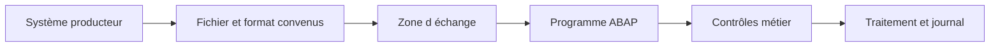

🌸 PRINCIPES DES INTERFACES FICHIERS

## 🌺 OBJECTIFS

- Identifier le rôle d’une interface fichier
- Distinguer transport, format et traitement métier
- Structurer un échange robuste et exploitable
- Délimiter le périmètre par rapport aux RFC et BAPI

## 🌺 DÉFINITION

Une **interface fichier** échange des données au moyen d’un fichier déposé ou récupéré dans un emplacement convenu. Le fichier constitue un contrat entre un producteur et un consommateur.

Une interface ne se limite pas à lire ou écrire des octets. Elle doit définir :

- le propriétaire du fichier ;
- l’emplacement de dépôt ;
- le nommage ;
- le format et l’encodage ;
- la fréquence ;
- les contrôles ;
- la gestion des doublons ;
- la stratégie de reprise ;
- la conservation et l’archivage.

## 🌺 COUCHES À SÉPARER

| Couche               | Responsabilité                                 |
| -------------------- | ---------------------------------------------- |
| Transport            | Dépôt, accès, déplacement ou téléchargement    |
| Sérialisation        | CSV, largeur fixe, XML, JSON ou binaire        |
| Validation technique | Structure, types, nombre de colonnes, encodage |
| Validation métier    | Existence et cohérence des données SAP         |
| Traitement           | Création ou modification via API métier        |
| Traçabilité          | Logs, statuts, compteurs et erreurs            |

## 🌺 PÉRIMÈTRE

Ce dossier traite les fichiers du serveur d’application et du poste utilisateur dans SAP GUI. Les RFC, BAPI et appels distants sont traités dans le dossier précédent. Les IDoc, services web et technologies d’intégration pourront faire l’objet de dossiers dédiés.

## 🌺 RÈGLE DIRECTRICE

Le programme doit pouvoir expliquer précisément :

1. quel fichier a été traité ;
2. avec quel format ;
3. quelles lignes ont été acceptées ou rejetées ;
4. quelles opérations SAP ont été exécutées ;
5. comment reprendre sans créer de doublons.

## 🌺 RÉFÉRENCES OFFICIELLES SAP

- [ABAP File Interface — SAP Help Portal](https://help.sap.com/docs/ABAP_PLATFORM_NEW/7bfe8cdcfbb040dcb6702dada8c3e2f0/fa2fd3be291f469f862c4c8215e0549b.html)
- [Physical and Logical File Names — SAP Help Portal](https://help.sap.com/docs/ABAP_PLATFORM_NEW/7bfe8cdcfbb040dcb6702dada8c3e2f0/9e49819d5b2a440fb508772494b9a473.html)

---

➡️ [Chapitre suivant — SERVEUR D APPLICATION OU POSTE UTILISATEUR](<./02 - 🍧 SERVEUR D APPLICATION OU POSTE UTILISATEUR.md>)
