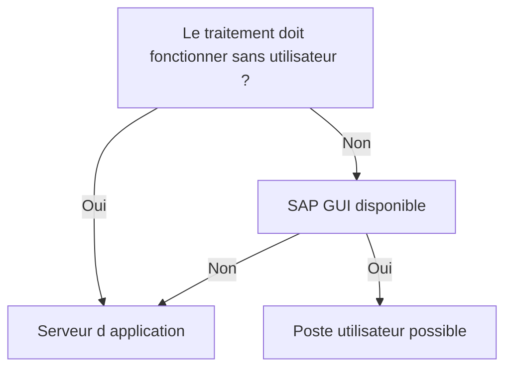

# 🌸 SERVEUR D’APPLICATION OU POSTE UTILISATEUR

## 🌺 OBJECTIFS

- Distinguer les deux emplacements de fichiers
- Choisir une solution compatible avec le mode d’exécution
- Éviter les dépendances au poste utilisateur

## 🌺 DEUX SYSTÈMES DE FICHIERS

Un programme ABAP peut principalement manipuler :

| Emplacement           | Exécution du code         | API principale                                          |
| --------------------- | ------------------------- | ------------------------------------------------------- |
| Serveur d’application | Instance AS ABAP          | Instructions `OPEN DATASET`, `READ DATASET`, `TRANSFER` |
| Poste utilisateur     | Machine exécutant SAP GUI | `CL_GUI_FRONTEND_SERVICES`                              |

## 🌺 SERVEUR D’APPLICATION

À privilégier pour :

- les traitements planifiés ;
- les interfaces automatiques ;
- les volumes importants ;
- les répertoires partagés avec un middleware ;
- les traitements nécessitant une reprise contrôlée.

Dans un système réparti, chaque instance peut disposer de son propre système de fichiers. Un chemin physique local n’est donc pas nécessairement visible depuis toutes les instances.

## 🌺 POSTE UTILISATEUR

À réserver aux interactions explicites :

- import manuel ponctuel ;
- export demandé par l’utilisateur ;
- sélection d’un fichier au moyen d’une boîte de dialogue.

Ces opérations dépendent de SAP GUI et ne doivent pas être utilisées dans un job de fond.

## 🌺 DÉCISION

| Besoin                                   | Choix recommandé      |
| ---------------------------------------- | --------------------- |
| Interface nocturne                       | Serveur d’application |
| Fichier déposé par CPI ou SFTP           | Serveur d’application |
| Export manuel d’une liste                | Poste utilisateur     |
| Traitement relançable sans session       | Serveur d’application |
| Sélection interactive d’un fichier local | Poste utilisateur     |

## 🌺 RÉFÉRENCES OFFICIELLES SAP

- [ABAP File Interface — SAP Help Portal](https://help.sap.com/docs/ABAP_PLATFORM_NEW/7bfe8cdcfbb040dcb6702dada8c3e2f0/fa2fd3be291f469f862c4c8215e0549b.html)
- [Files on the Presentation Server — ABAP Keyword Documentation](https://help.sap.com/doc/abapdocu_latest_index_htm/latest/en-US/ABENFRONTEND_FILES.html)
- [Physical and Logical File Names — SAP Help Portal](https://help.sap.com/docs/ABAP_PLATFORM_NEW/7bfe8cdcfbb040dcb6702dada8c3e2f0/9e49819d5b2a440fb508772494b9a473.html)

---

➡️ [Chapitre suivant — REPERTOIRES SERVEUR ET TRANSACTION AL11](<./03 - 🍧 REPERTOIRES SERVEUR ET TRANSACTION AL11.md>)
