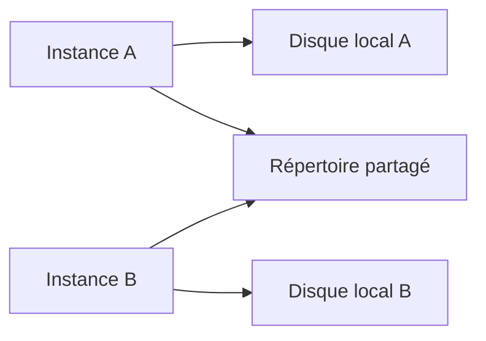

# 🌸 RÉPERTOIRES SERVEUR ET TRANSACTION AL11

## 🌺 OBJECTIFS

- Comprendre le rôle de `AL11`
- Identifier les limites d’un chemin serveur
- Vérifier un fichier sans confondre consultation et configuration

## 🌺 RÔLE DE `AL11`

La transaction `AL11` affiche les répertoires du serveur d’application déclarés dans la configuration du système. Elle permet généralement de consulter les fichiers accessibles depuis l’instance concernée.

`AL11` n’est pas un explorateur universel du système d’exploitation et ne remplace pas :

- la configuration des noms logiques ;
- les autorisations ABAP ;
- les droits du compte système d’exploitation ;
- une procédure d’archivage ou de transfert.

## 🌺 SYSTÈME RÉPARTI



Un fichier écrit sur un disque local de l’instance A peut être introuvable si le job suivant s’exécute sur l’instance B. Les interfaces automatiques doivent utiliser un stockage partagé ou une contrainte d’exécution maîtrisée.

## 🌺 VÉRIFICATIONS

Avant le développement :

1. identifier le répertoire logique attendu ;
2. confirmer qu’il existe dans chaque environnement ;
3. vérifier s’il est partagé entre instances ;
4. connaître le compte chargé de déposer ou récupérer le fichier ;
5. vérifier les règles de purge ;
6. tester avec l’utilisateur technique réel.

## 🌺 UTILISATION PROFESSIONNELLE

Ne coder aucun chemin observé uniquement en développement. Un chemin comme `/usr/sap/.../interface` peut différer entre DEV, QAS et PRD. La résolution doit passer par un nom logique ou une configuration applicative transportable.

## 🌺 PROCÉDURE PAS À PAS

1. Saisir `/nAL11`.
2. Identifier le répertoire logique autorisé correspondant à l’interface.
3. Afficher son contenu et relever nom, date et taille du fichier.
4. Ne pas supposer qu’un fichier visible est lisible par le programme : vérifier aussi le chemin physique et les autorisations.
5. Pour un test, utiliser un fichier non productif et documenter l’horodatage.

## 🌺 ERREURS FRÉQUENTES

- Mélanger fichiers frontend et serveur dans un même scénario.
- Parser un CSV par simple séparation alors que les champs peuvent être échappés.

## 🌺 FICHE DE CONTRÔLE À COPIER

```text
Système / SID       :
Mandant             :
Utilisateur         :
Transaction / outil :
Objet technique     :
Jeu de données      :
Résultat attendu    :
Résultat observé    :
Horodatage          :
Ordre de transport  :
```

## 🌺 TERMES DU LEXIQUE

- [Transaction](<../└─ 🧩 00 - LEXIQUE SAP ET ABAP/02 - 🍧 SAP GUI NAVIGATION ET TRANSACTIONS.md#transaction>)
- [Interface](<../└─ 🧩 00 - LEXIQUE SAP ET ABAP/07 - 🍧 INTERFACES ET INTEGRATION.md#interface-integration>)
- [Flux entrant](<../└─ 🧩 00 - LEXIQUE SAP ET ABAP/07 - 🍧 INTERFACES ET INTEGRATION.md#flux-entrant>)
- [Flux sortant](<../└─ 🧩 00 - LEXIQUE SAP ET ABAP/07 - 🍧 INTERFACES ET INTEGRATION.md#flux-sortant>)
- [CSV](<../└─ 🧩 00 - LEXIQUE SAP ET ABAP/07 - 🍧 INTERFACES ET INTEGRATION.md#csv>)
- [Encodage](<../└─ 🧩 00 - LEXIQUE SAP ET ABAP/07 - 🍧 INTERFACES ET INTEGRATION.md#encodage>)

## 🌺 RÉFÉRENCES OFFICIELLES SAP

- [ABAP File Interface — SAP Help Portal](https://help.sap.com/docs/ABAP_PLATFORM_NEW/7bfe8cdcfbb040dcb6702dada8c3e2f0/fa2fd3be291f469f862c4c8215e0549b.html)
- [Physical and Logical File Names — SAP Help Portal](https://help.sap.com/docs/ABAP_PLATFORM_NEW/7bfe8cdcfbb040dcb6702dada8c3e2f0/9e49819d5b2a440fb508772494b9a473.html)


---

➡️ [Chapitre suivant — NOMS ET CHEMINS LOGIQUES AVEC `FILE`](<./04 - 🍧 NOMS ET CHEMINS LOGIQUES AVEC FILE.md>)
