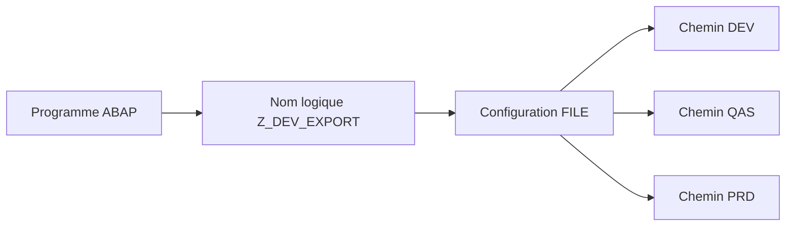

# 🌸 NOMS ET CHEMINS LOGIQUES AVEC `FILE`

## 🌺 OBJECTIFS

- Éviter les chemins physiques codés en dur
- Configurer des noms indépendants de la plateforme
- Résoudre un nom logique dans un programme ABAP

## 🌺 PRINCIPE

La transaction `FILE` permet de définir des chemins et noms de fichiers logiques indépendants du système d’exploitation. Chaque environnement résout ensuite le même nom logique vers un chemin physique adapté.



## 🌺 ÉLÉMENTS

| Élément                | Rôle                                                             |
| ---------------------- | ---------------------------------------------------------------- |
| Chemin logique         | Représente un répertoire selon la plateforme                     |
| Nom de fichier logique | Décrit le fichier et son format physique                         |
| Syntax group           | Permet des définitions spécifiques au système d’exploitation     |
| Paramètres             | Injectent une date, un identifiant ou une autre valeur contrôlée |

## 🌺 RÉSOLUTION DANS LE PROGRAMME

```abap
DATA lv_file TYPE string.

CALL FUNCTION 'FILE_GET_NAME'
  EXPORTING
    logical_filename = 'Z_DEV_EXPORT_PRODUCTS'
    parameter_1      = sy-datum
  IMPORTING
    file_name        = lv_file
  EXCEPTIONS
    file_not_found   = 1
    OTHERS           = 2.

IF sy-subrc <> 0.
  MESSAGE e001(zdev_file).
ENDIF.
```

L’interface exacte du module fonction doit être vérifiée dans `SE37` sur la version du système.

## 🌺 RÈGLES

- Utiliser des noms explicites préfixés par l’espace client.
- Contrôler les paramètres injectés.
- Ne jamais injecter directement un chemin saisi librement par l’utilisateur.
- Tester la résolution dans tous les environnements.
- Documenter le propriétaire de la configuration `FILE`.

## 🌺 RÉFÉRENCES OFFICIELLES SAP

- [Physical and Logical File Names — SAP Help Portal](https://help.sap.com/docs/ABAP_PLATFORM_NEW/7bfe8cdcfbb040dcb6702dada8c3e2f0/9e49819d5b2a440fb508772494b9a473.html)
- [Defining Logical Path and File Names — SAP Help Portal](https://help.sap.com/docs/SAP_NETWEAVER_700/10907a5e6c531014a252fdc4265a1f8e/4d88692f8d7a40ade10000000a15822b.html)

---

➡️ [Chapitre suivant — AUTORISATIONS ET SECURITE DES FICHIERS](<./05 - 🍧 AUTORISATIONS ET SECURITE DES FICHIERS.md>)
