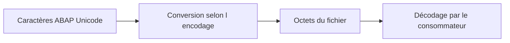

# 🌸 ENCODAGE, CODE PAGES, BOM ET FINS DE LIGNE

## 🌺 OBJECTIFS

- Comprendre les causes des caractères corrompus
- Définir un encodage explicite
- Tester les différences de plateformes

## 🌺 ENCODAGE

Un fichier texte est une séquence d’octets. L’encodage définit la correspondance entre ces octets et les caractères.



## 🌺 UTF-8

UTF-8 constitue généralement le meilleur contrat pour une nouvelle interface. Le contrat doit préciser si un **BOM** est attendu.

```abap
OPEN DATASET lv_file
  FOR OUTPUT
  IN TEXT MODE
  ENCODING UTF-8
  WITH BYTE-ORDER MARK.
```

La disponibilité et le comportement exact des additions doivent être vérifiés sur la version ABAP cible.

## 🌺 FINS DE LIGNE

Windows utilise généralement CRLF, tandis que les systèmes Unix utilisent LF. En mode texte, l’interface ABAP gère les séparateurs selon les options et la plateforme. Le système consommateur doit accepter le format produit ou le contrat doit l’imposer explicitement.

## 🌺 TEST MINIMAL

Tester au minimum :

```text
Élément;Garçon;東京;€;"texte";ligne vide
```

Puis vérifier :

- le nombre de caractères ;
- le nombre d’octets ;
- les séparateurs ;
- l’ouverture dans l’outil consommateur ;
- la présence éventuelle du BOM.

## 🌺 ERREURS COURANTES

- écrire en `DEFAULT` et lire en UTF-8 ;
- confondre encodage et langue ;
- convertir plusieurs fois le même contenu ;
- utiliser Excel comme seul outil de validation ;
- ignorer les caractères de contrôle invisibles.

## 🌺 RÉFÉRENCES OFFICIELLES SAP

- [Character Set and File Interface Guidelines — ABAP Keyword Documentation](https://help.sap.com/doc/abapdocu_latest_index_htm/latest/en-US/ABENCODEPAGE_FILE_GUIDL.html)
- [OPEN DATASET Modes — ABAP Keyword Documentation](https://help.sap.com/doc/abapdocu_latest_index_htm/latest/en-US/ABAPOPEN_DATASET_MODE.html)
- [GET DATASET — ABAP Keyword Documentation](https://help.sap.com/doc/abapdocu_latest_index_htm/latest/en-US/ABAPGET_DATASET.html)

---

➡️ [Chapitre suivant — SERVICES FICHIERS DU FRONTEND](<./13 - 🍧 SERVICES FICHIERS DU FRONTEND.md>)
