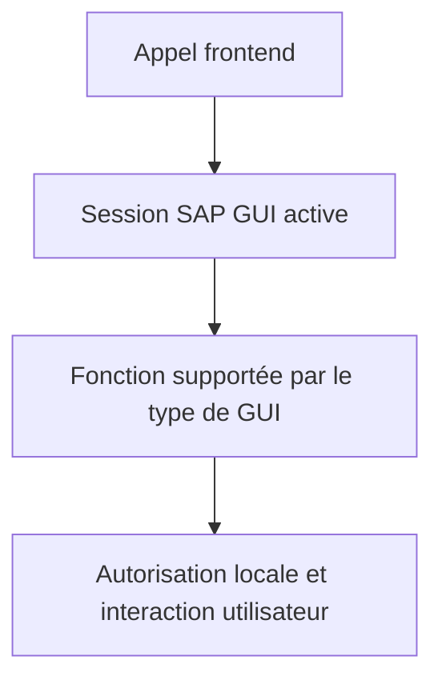

# 🌸 SERVICES FICHIERS DU FRONTEND

## 🌺 OBJECTIFS

- Utiliser les services du poste SAP GUI
- Comprendre leurs dépendances techniques
- Éviter les anciens modules fonction obsolètes

## 🌺 CLASSE PRINCIPALE

`CL_GUI_FRONTEND_SERVICES` fournit des méthodes statiques pour interagir avec le système de fichiers du poste utilisateur :

- sélection de fichiers ;
- import et export ;
- interrogation de répertoires ;
- opérations de copie ou suppression locales ;
- accès à certaines fonctions du frontend.

Les anciennes fonctions comme `WS_UPLOAD`, `WS_DOWNLOAD` ou `WS_FILENAME_GET` ne doivent pas être utilisées dans un nouveau développement.

## 🌺 CONTRAINTES

- Aucun fonctionnement fiable en job de fond.
- Le comportement peut varier entre SAP GUI for Windows, Java et WebGUI.
- Certaines opérations déclenchent des contrôles de sécurité frontend.
- Le chemin appartient au poste, pas au serveur SAP.

## 🌺 TEST DE DISPONIBILITÉ

Avant une opération locale, contrôler le contexte d’exécution. Les méthodes et constantes disponibles doivent être inspectées dans `SE24` sur la version cible.

## 🌺 RÈGLE D’ARCHITECTURE

Le traitement métier ne doit pas dépendre directement d’une boîte de dialogue. Séparer :

1. la sélection ou le téléchargement local ;
2. la lecture du contenu ;
3. la validation ;
4. le traitement métier.

Cette séparation permet de réutiliser le même cœur de traitement avec un fichier serveur.

## 🌺 RÉFÉRENCES OFFICIELLES SAP

- [Files on the Presentation Server — ABAP Keyword Documentation](https://help.sap.com/doc/abapdocu_latest_index_htm/latest/en-US/ABENFRONTEND_FILES.html)
- [File Upload and Download — SAP Help Portal](https://help.sap.com/docs/ABAP_PLATFORM_NEW/5a005e044eef436f8b27bbd3f73a3cfc/9ff8506b2b8f4812904912c4b207096c.html)

---

➡️ [Chapitre suivant — DIALOGUES DE SELECTION ET SAUVEGARDE](<./14 - 🍧 DIALOGUES DE SELECTION ET SAUVEGARDE.md>)
