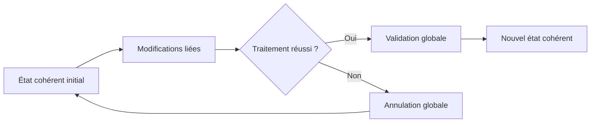

# 🌸 PRINCIPES DE COHÉRENCE TRANSACTIONNELLE

## 🌺 OBJECTIFS

- Comprendre pourquoi plusieurs écritures doivent être traitées comme une seule opération métier
- Identifier les trois mécanismes classiques : LUW, verrouillage et mise à jour
- Concevoir un traitement suivant le principe « tout ou rien »

## 🌺 PROBLÈME À RÉSOUDRE

Une opération métier modifie souvent plusieurs objets persistants. Une commande peut nécessiter la création d’un en-tête, de postes, de statuts et d’un historique. En cas d’échec, la base ne doit pas conserver un état partiel incohérent.

## 🌺 TROIS MÉCANISMES COMPLÉMENTAIRES

| Mécanisme        | Rôle                                                                |
| ---------------- | ------------------------------------------------------------------- |
| SAP LUW          | Regrouper les modifications d’une opération métier                  |
| Verrouillage SAP | Empêcher des modifications concurrentes incompatibles               |
| Mise à jour SAP  | Reporter et regrouper les écritures exécutées lors de la validation |

Une écriture SQL réussie ne signifie pas encore que toute l’opération métier est validée. La frontière transactionnelle appartient au traitement appelant.

## 🌺 RÈGLE DIRECTRICE

Le programme doit définir explicitement :

1. le début logique de l’opération ;
2. les données à verrouiller ;
3. les contrôles effectués avant l’écriture ;
4. le point unique de validation ;
5. le comportement en cas d’erreur ;
6. la méthode de diagnostic et de reprise.

## 🌺 RÉFÉRENCES OFFICIELLES SAP

- [LUWs in ABAP — SAP Help Portal](https://help.sap.com/docs/ABAP_PLATFORM_NEW/8132142fd1a144a59303663a03a7c2d4/54f5462a9604498382319304869a4280.html)
- [LUW and Transactional Phases — SAP Help Portal](https://help.sap.com/docs/abap-cloud/abap-concepts/luw-and-transactional-phases)

---

➡️ [Chapitre suivant — LUW BASE DE DONNEES ET SAP LUW](<./02 - 🍧 LUW BASE DE DONNEES ET SAP LUW.md>)
