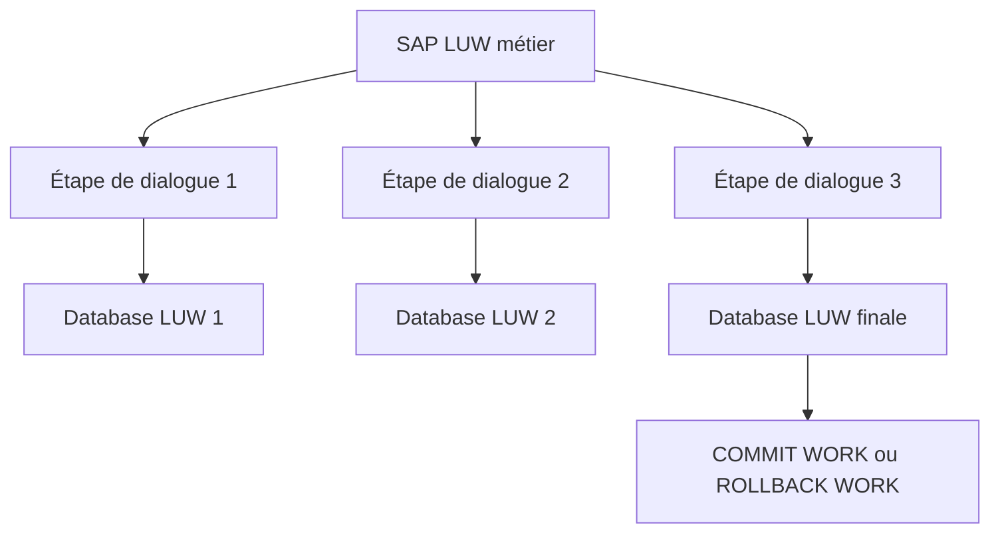

# 🌸 LUW BASE DE DONNÉES ET SAP LUW

## 🌺 OBJECTIFS

- Distinguer une LUW de base de données d’une SAP LUW
- Comprendre pourquoi une transaction SAP peut couvrir plusieurs étapes de dialogue
- Identifier les responsabilités de chaque niveau

## 🌺 LUW DE BASE DE DONNÉES

Une **database LUW** est une séquence indivisible d’opérations sur la base, terminée par un commit ou un rollback de base de données. Elle est liée à une connexion et à un processus de travail.

## 🌺 SAP LUW

Une **SAP LUW** regroupe toutes les modifications appartenant à une même opération métier, même si le traitement traverse plusieurs étapes de dialogue et donc plusieurs database LUW.

## 🌺 DIFFÉRENCE ESSENTIELLE

| Question                 | Database LUW                 | SAP LUW                          |
| ------------------------ | ---------------------------- | -------------------------------- |
| Portée                   | Connexion et étape technique | Opération métier                 |
| Fin                      | Commit ou rollback DB        | `COMMIT WORK` ou `ROLLBACK WORK` |
| Plusieurs écrans         | Non                          | Oui                              |
| Verrous SAP longue durée | Non                          | Oui                              |
| Update task              | Non                          | Oui                              |

Le mécanisme SAP est nécessaire parce qu’un verrou de base de données ne doit pas rester actif pendant qu’un utilisateur réfléchit sur un écran.

## 🌺 CAS D’USAGE

Dans un contexte où plusieurs modifications liées doivent être validées ensemble et protégées contre les accès concurrents, le besoin consiste à **répéter un traitement un nombre connu ou borné de fois**. Cette notion est pertinente lorsque le lecteur doit pouvoir relier la syntaxe ou l’outil à une situation professionnelle concrète.

## 🌺 PROCÉDURE PAS À PAS

1. Lire la définition et identifier les prérequis du chapitre.
2. Choisir un objet Z ou un scénario de démonstration sans impact métier.
3. Reproduire l’exemple dans un système de développement et relever les données d’entrée.
4. Contrôler la syntaxe ou la configuration avant activation/exécution.
5. Comparer le résultat observé avec la section **Vérification**.
6. Documenter toute différence liée à la release, aux autorisations ou au paramétrage du système.

## 🌺 VÉRIFICATION

- Les données sont toutes validées ou toutes annulées selon le cas testé.
- Les verrous sont libérés à la fin du traitement normal et après erreur.
- Aucune update en erreur inattendue ne reste dans `SM13`.
- Les collisions concurrentes produisent un message contrôlé, pas une incohérence.

## 🌺 ERREURS FRÉQUENTES

- Supprimer manuellement un verrou sans comprendre son propriétaire.
- Relancer une update en erreur sans vérifier l’état métier.

## 🌺 TERMES DU LEXIQUE

- [LUW base de données](<../└─ 🧩 00 - LEXIQUE SAP ET ABAP/08 - 🍧 EXECUTION EXPLOITATION ET ADMINISTRATION.md#luw-base>)
- [SAP LUW](<../└─ 🧩 00 - LEXIQUE SAP ET ABAP/08 - 🍧 EXECUTION EXPLOITATION ET ADMINISTRATION.md#sap-luw>)
- [COMMIT WORK](<../└─ 🧩 00 - LEXIQUE SAP ET ABAP/08 - 🍧 EXECUTION EXPLOITATION ET ADMINISTRATION.md#commit-work>)
- [ROLLBACK WORK](<../└─ 🧩 00 - LEXIQUE SAP ET ABAP/08 - 🍧 EXECUTION EXPLOITATION ET ADMINISTRATION.md#rollback-work>)
- [Enqueue server](<../└─ 🧩 00 - LEXIQUE SAP ET ABAP/08 - 🍧 EXECUTION EXPLOITATION ET ADMINISTRATION.md#enqueue-server>)
- [Update task](<../└─ 🧩 00 - LEXIQUE SAP ET ABAP/08 - 🍧 EXECUTION EXPLOITATION ET ADMINISTRATION.md#update-task>)

## 🌺 À RETENIR

- À l’issue du chapitre, le lecteur sait **répéter un traitement un nombre connu ou borné de fois**.
- Toujours tester sur un objet Z ou un jeu de données sans impact avant d’intervenir sur un traitement réel.
- La documentation `F1` du système reste la référence pour la syntaxe disponible dans sa release.

## 🌺 RÉFÉRENCES OFFICIELLES SAP

- [Database Logical Unit of Work — SAP Help Portal](https://help.sap.com/docs/SAP_NETWEAVER_703/a0f7f14dd0414b13aaf81261cc50f809/417af4bca79e11d1950f0000e82de14a.html)
- [LUWs in ABAP — SAP Help Portal](https://help.sap.com/docs/ABAP_PLATFORM_NEW/8132142fd1a144a59303663a03a7c2d4/54f5462a9604498382319304869a4280.html)

---

➡️ [Chapitre suivant — BORNES DE TRANSACTION ET COMMITS IMPLICITES](<./03 - 🍧 BORNES DE TRANSACTION ET COMMITS IMPLICITES.md>)
