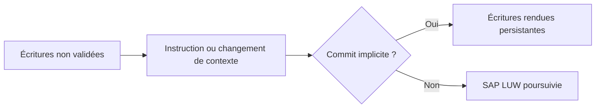

# 🌸 BORNES DE TRANSACTION ET COMMITS IMPLICITES

## 🌺 OBJECTIFS

- Identifier les événements pouvant terminer une database LUW
- Éviter les validations accidentelles au milieu d’un traitement
- Protéger la phase de sauvegarde

## 🌺 COMMITS EXPLICITES ET IMPLICITES

`COMMIT WORK` termine explicitement la SAP LUW. Le runtime ABAP peut également déclencher des commits de base de données lors de certains changements de contexte, par exemple lorsqu’un traitement quitte une étape de dialogue ou transfère le contrôle vers un autre processus.

## 🌺 SITUATIONS À ANALYSER

- appel RFC synchrone ou asynchrone ;
- `WAIT` ;
- changement d’étape de dialogue ;
- certains appels de programmes ou de transactions ;
- instruction explicitement documentée comme provoquant un commit.

La liste exacte dépend du contexte et de la version. Vérifier la documentation de l’instruction utilisée au lieu de supposer qu’un appel est transactionnellement neutre.

## 🌺 RÈGLE DE CONCEPTION

Pendant une phase de sauvegarde :

- ne pas appeler un composant dont le contrat transactionnel est inconnu ;
- ne pas exécuter de `COMMIT WORK` dans une API réutilisable ;
- ne pas déléguer la validation à une méthode profonde ;
- laisser le propriétaire de la transaction décider du commit ou du rollback.

## 🌺 CAS D’USAGE

Dans un contexte où plusieurs modifications liées doivent être validées ensemble et protégées contre les accès concurrents, le besoin consiste à **appliquer bornes de transaction et commits implicites dans une transaction cohérente et vérifier verrous, validation et annulation**. Cette notion est pertinente lorsque le lecteur doit pouvoir relier la syntaxe ou l’outil à une situation professionnelle concrète.

## 🌺 PROCÉDURE PAS À PAS

1. Lire la définition et identifier les prérequis du chapitre.
2. Choisir un objet Z ou un scénario de démonstration sans impact métier.
3. Reproduire l’exemple dans un système de développement et relever les données d’entrée.
4. Contrôler la syntaxe ou la configuration avant activation/exécution.
5. Comparer le résultat observé avec la section **Vérification**.
6. Documenter toute différence liée à la release, aux autorisations ou au paramétrage du système.

## 🌺 VÉRIFICATION

- Les données sont toutes validées ou toutes annulées selon le cas testé.
- Les verrous sont libérés à la fin du traitement normal et après erreur.
- Aucune update en erreur inattendue ne reste dans `SM13`.
- Les collisions concurrentes produisent un message contrôlé, pas une incohérence.

## 🌺 ERREURS FRÉQUENTES

- Supprimer manuellement un verrou sans comprendre son propriétaire.
- Relancer une update en erreur sans vérifier l’état métier.

## 🌺 TERMES DU LEXIQUE

- [Transaction](<../└─ 🧩 00 - LEXIQUE SAP ET ABAP/02 - 🍧 SAP GUI NAVIGATION ET TRANSACTIONS.md#transaction>)
- [SAP LUW](<../└─ 🧩 00 - LEXIQUE SAP ET ABAP/08 - 🍧 EXECUTION EXPLOITATION ET ADMINISTRATION.md#sap-luw>)
- [LUW base de données](<../└─ 🧩 00 - LEXIQUE SAP ET ABAP/08 - 🍧 EXECUTION EXPLOITATION ET ADMINISTRATION.md#luw-base>)
- [COMMIT WORK](<../└─ 🧩 00 - LEXIQUE SAP ET ABAP/08 - 🍧 EXECUTION EXPLOITATION ET ADMINISTRATION.md#commit-work>)
- [ROLLBACK WORK](<../└─ 🧩 00 - LEXIQUE SAP ET ABAP/08 - 🍧 EXECUTION EXPLOITATION ET ADMINISTRATION.md#rollback-work>)
- [Enqueue server](<../└─ 🧩 00 - LEXIQUE SAP ET ABAP/08 - 🍧 EXECUTION EXPLOITATION ET ADMINISTRATION.md#enqueue-server>)

## 🌺 À RETENIR

- À l’issue du chapitre, le lecteur sait **appliquer bornes de transaction et commits implicites dans une transaction cohérente et vérifier verrous, validation et annulation**.
- Toujours tester sur un objet Z ou un jeu de données sans impact avant d’intervenir sur un traitement réel.
- La documentation `F1` du système reste la référence pour la syntaxe disponible dans sa release.

## 🌺 RÉFÉRENCES OFFICIELLES SAP

- [LUWs in ABAP — SAP Help Portal](https://help.sap.com/docs/ABAP_PLATFORM_NEW/8132142fd1a144a59303663a03a7c2d4/54f5462a9604498382319304869a4280.html)
- [Transactional Consistency Check — SAP Help Portal](https://help.sap.com/docs/ABAP_PLATFORM_NEW/753088fc00704d0a80e7fbd6803c8adb/89be29c77d1b4b5e80678e4d2da51345.html)
- [Committing Database Changes — SAP Help Portal](https://help.sap.com/docs/SAP_NETWEAVER_702/fe24b0146c551014891ad42d6b2789e5/fceb3b64358411d1829f0000e829fbfe.html)

---

➡️ [Chapitre suivant — `COMMIT WORK` ET `COMMIT WORK AND WAIT`](<./04 - 🍧 COMMIT WORK ET COMMIT WORK AND WAIT.md>)
