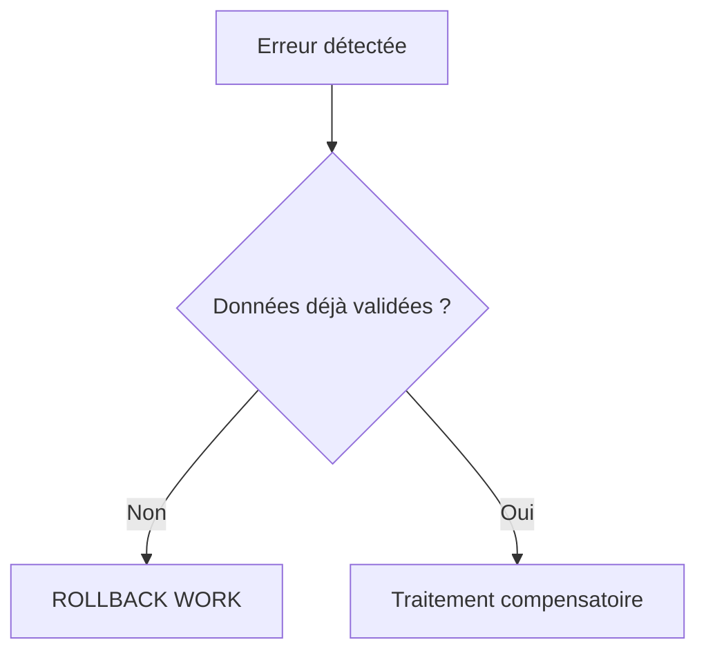

# 🌸 `ROLLBACK WORK` ET ANNULATION

## 🌺 OBJECTIFS

- Annuler la SAP LUW courante
- Comprendre les effets sur les mises à jour enregistrées
- Différencier annulation technique et compensation métier

## 🌺 UTILISATION

```abap
UPDATE zdev_order
  SET status = @lv_status
  WHERE order_id = @lv_order_id.

IF sy-subrc <> 0.
  ROLLBACK WORK.
  MESSAGE e002(zdev_msg) WITH lv_order_id.
ENDIF.
```

`ROLLBACK WORK` déclenche un rollback des modifications non validées et supprime les modules de mise à jour enregistrés dans la SAP LUW courante.

## 🌺 LIMITES

Un rollback ne peut pas annuler :

- une modification déjà validée par un commit antérieur ;
- un effet externe déjà exécuté dans un autre système ;
- un fichier déjà publié ;
- un e-mail déjà envoyé ;
- une écriture effectuée sur une connexion transactionnellement indépendante.

Ces situations nécessitent une **compensation métier**, pas un rollback technique.



## 🌺 RÈGLE

Détecter les erreurs avant les effets irréversibles. Une architecture qui dépend d’un rollback après des appels externes est fragile.

## 🌺 CAS D’USAGE

Dans un contexte où plusieurs modifications liées doivent être validées ensemble et protégées contre les accès concurrents, le besoin consiste à **annuler les modifications non validées après une erreur bloquante**. Cette notion est pertinente lorsque le lecteur doit pouvoir relier la syntaxe ou l’outil à une situation professionnelle concrète.

## 🌺 PROCÉDURE PAS À PAS

1. Saisir `/nSE38` dans le champ de commande.
2. Entrer le nom d’un programme Z de test, par exemple `ZREF_DEMO`, puis choisir **Créer** ou **Modifier** selon le cas.
3. Pour un exercice local uniquement, affecter `$TMP` ; pour un développement livrable, utiliser le package et l’ordre fournis par le projet.
4. Coller ou adapter le snippet du chapitre.
5. Exécuter le contrôle syntaxique avec `Ctrl+F2`.
6. Activer avec `Ctrl+F3`.
7. Exécuter avec `F8` et comparer le résultat avec la section **Vérification**.

## 🌺 VÉRIFICATION

- Les données sont toutes validées ou toutes annulées selon le cas testé.
- Les verrous sont libérés à la fin du traitement normal et après erreur.
- Aucune update en erreur inattendue ne reste dans `SM13`.
- Les collisions concurrentes produisent un message contrôlé, pas une incohérence.

## 🌺 ERREURS FRÉQUENTES

- Copier un exemple sans adapter les types, noms d’objets et données disponibles dans le système.
- Tester uniquement le cas nominal et ignorer les valeurs initiales, absentes ou invalides.
- Supprimer manuellement un verrou sans comprendre son propriétaire.
- Relancer une update en erreur sans vérifier l’état métier.

## 🌺 SNIPPET À RÉUTILISER

> [!NOTE]
> Adapter les noms `Z*`, les types DDIC, les données et les autorisations au système cible. Effectuer un contrôle syntaxique avant activation.

```abap
UPDATE zdev_order
  SET status = @lv_status
  WHERE order_id = @lv_order_id.

IF sy-subrc <> 0.
  ROLLBACK WORK.
  MESSAGE e002(zdev_msg) WITH lv_order_id.
ENDIF.
```

## 🌺 TERMES DU LEXIQUE

- [ROLLBACK WORK](<../└─ 🧩 00 - LEXIQUE SAP ET ABAP/08 - 🍧 EXECUTION EXPLOITATION ET ADMINISTRATION.md#rollback-work>)
- [SAP LUW](<../└─ 🧩 00 - LEXIQUE SAP ET ABAP/08 - 🍧 EXECUTION EXPLOITATION ET ADMINISTRATION.md#sap-luw>)
- [LUW base de données](<../└─ 🧩 00 - LEXIQUE SAP ET ABAP/08 - 🍧 EXECUTION EXPLOITATION ET ADMINISTRATION.md#luw-base>)
- [COMMIT WORK](<../└─ 🧩 00 - LEXIQUE SAP ET ABAP/08 - 🍧 EXECUTION EXPLOITATION ET ADMINISTRATION.md#commit-work>)
- [Enqueue server](<../└─ 🧩 00 - LEXIQUE SAP ET ABAP/08 - 🍧 EXECUTION EXPLOITATION ET ADMINISTRATION.md#enqueue-server>)
- [Update task](<../└─ 🧩 00 - LEXIQUE SAP ET ABAP/08 - 🍧 EXECUTION EXPLOITATION ET ADMINISTRATION.md#update-task>)

## 🌺 À RETENIR

- À l’issue du chapitre, le lecteur sait **annuler les modifications non validées après une erreur bloquante**.
- Toujours tester sur un objet Z ou un jeu de données sans impact avant d’intervenir sur un traitement réel.
- La documentation `F1` du système reste la référence pour la syntaxe disponible dans sa release.

## 🌺 RÉFÉRENCES OFFICIELLES SAP

- [ROLLBACK WORK — ABAP Keyword Documentation](https://help.sap.com/docs/ABAP_PLATFORM_NEW/8132142fd1a144a59303663a03a7c2d4/54f5462a9604498382319304869a4280.html)
- [LUWs in ABAP — SAP Help Portal](https://help.sap.com/docs/ABAP_PLATFORM_NEW/8132142fd1a144a59303663a03a7c2d4/54f5462a9604498382319304869a4280.html)


---

➡️ [Chapitre suivant — CONCEPT DE VERROUILLAGE SAP](<./06 - 🍧 CONCEPT DE VERROUILLAGE SAP.md>)
