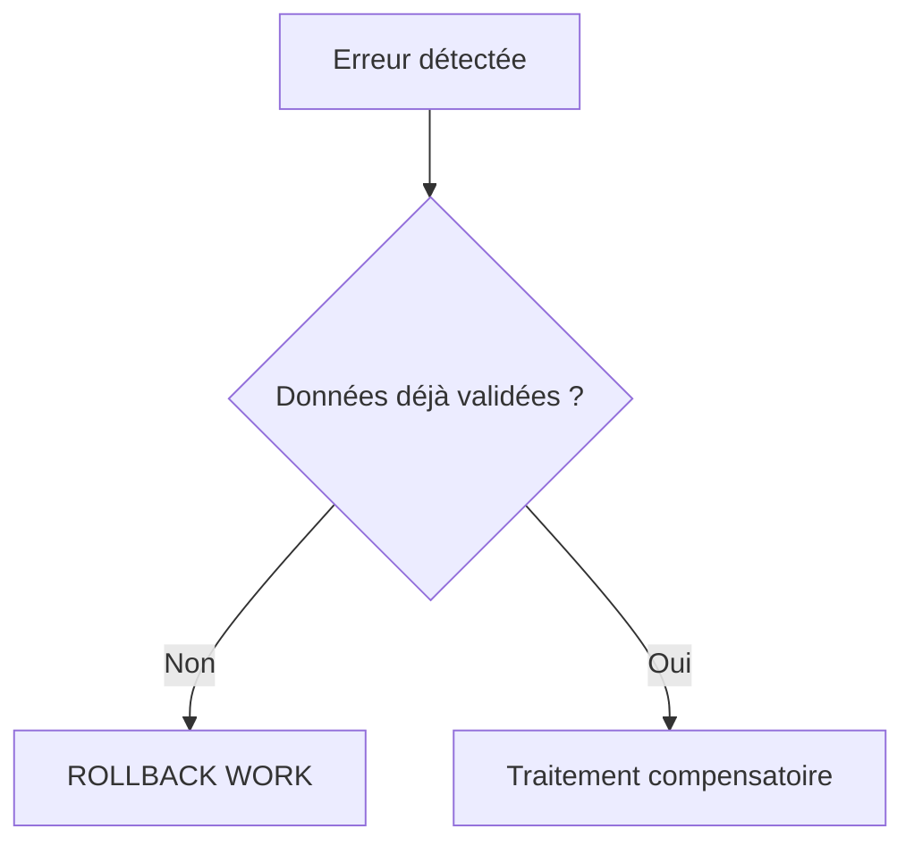

# 🌸 `ROLLBACK WORK` ET ANNULATION

## 🌺 OBJECTIFS

- Annuler la SAP LUW courante
- Comprendre les effets sur les mises à jour enregistrées
- Différencier annulation technique et compensation métier

## 🌺 UTILISATION

```abap
UPDATE zdev_order
  SET status = @lv_status
  WHERE order_id = @lv_order_id.

IF sy-subrc <> 0.
  ROLLBACK WORK.
  MESSAGE e002(zdev_msg) WITH lv_order_id.
ENDIF.
```

`ROLLBACK WORK` déclenche un rollback des modifications non validées et supprime les modules de mise à jour enregistrés dans la SAP LUW courante.

## 🌺 LIMITES

Un rollback ne peut pas annuler :

- une modification déjà validée par un commit antérieur ;
- un effet externe déjà exécuté dans un autre système ;
- un fichier déjà publié ;
- un e-mail déjà envoyé ;
- une écriture effectuée sur une connexion transactionnellement indépendante.

Ces situations nécessitent une **compensation métier**, pas un rollback technique.



## 🌺 RÈGLE

Détecter les erreurs avant les effets irréversibles. Une architecture qui dépend d’un rollback après des appels externes est fragile.

## 🌺 RÉFÉRENCES OFFICIELLES SAP

- [ROLLBACK WORK — ABAP Keyword Documentation](https://help.sap.com/docs/ABAP_PLATFORM_NEW/8132142fd1a144a59303663a03a7c2d4/54f5462a9604498382319304869a4280.html)
- [LUWs in ABAP — SAP Help Portal](https://help.sap.com/docs/ABAP_PLATFORM_NEW/8132142fd1a144a59303663a03a7c2d4/54f5462a9604498382319304869a4280.html)

---

➡️ [Chapitre suivant — CONCEPT DE VERROUILLAGE SAP](<./06 - 🍧 CONCEPT DE VERROUILLAGE SAP.md>)
