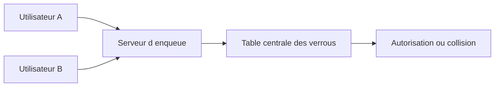

# 🌸 CONCEPT DE VERROUILLAGE SAP

## 🌺 OBJECTIFS

- Comprendre le rôle du verrouillage logique SAP
- Distinguer verrou SAP et verrou de base de données
- Prévenir les mises à jour concurrentes perdues

## 🌺 POURQUOI UN VERROU SAP

Une transaction interactive peut couvrir plusieurs écrans. Les verrous de base de données sont libérés à la fin de chaque database LUW ; ils ne peuvent donc pas protéger seuls l’ensemble de l’opération métier.

Le système SAP maintient une table centrale de verrous en mémoire. Chaque entrée décrit un objet métier, une clé, un propriétaire et un mode de verrouillage.

## 🌺 VERROU OPTIMISTE OU PESSIMISTE

- Un verrou pessimiste est pris avant la modification et empêche immédiatement un accès concurrent incompatible.
- Un verrou optimiste autorise d’abord plusieurs lecteurs, puis tente une conversion avant la sauvegarde.

## 🌺 RÈGLE

Verrouiller l’objet métier, pas seulement une instruction SQL. Le verrou doit couvrir la période comprise entre la lecture déterminante et la validation.

## 🌺 CAS D’USAGE

Dans un contexte où plusieurs modifications liées doivent être validées ensemble et protégées contre les accès concurrents, le besoin consiste à **appliquer concept de verrouillage sap dans une transaction cohérente et vérifier verrous, validation et annulation**. Cette notion est pertinente lorsque le lecteur doit pouvoir relier la syntaxe ou l’outil à une situation professionnelle concrète.

## 🌺 PROCÉDURE PAS À PAS

1. Lire la définition et identifier les prérequis du chapitre.
2. Choisir un objet Z ou un scénario de démonstration sans impact métier.
3. Reproduire l’exemple dans un système de développement et relever les données d’entrée.
4. Contrôler la syntaxe ou la configuration avant activation/exécution.
5. Comparer le résultat observé avec la section **Vérification**.
6. Documenter toute différence liée à la release, aux autorisations ou au paramétrage du système.

## 🌺 VÉRIFICATION

- Les données sont toutes validées ou toutes annulées selon le cas testé.
- Les verrous sont libérés à la fin du traitement normal et après erreur.
- Aucune update en erreur inattendue ne reste dans `SM13`.
- Les collisions concurrentes produisent un message contrôlé, pas une incohérence.

## 🌺 ERREURS FRÉQUENTES

- Supprimer manuellement un verrou sans comprendre son propriétaire.
- Relancer une update en erreur sans vérifier l’état métier.

## 🌺 TERMES DU LEXIQUE

- [SAP LUW](<../└─ 🧩 00 - LEXIQUE SAP ET ABAP/08 - 🍧 EXECUTION EXPLOITATION ET ADMINISTRATION.md#sap-luw>)
- [LUW base de données](<../└─ 🧩 00 - LEXIQUE SAP ET ABAP/08 - 🍧 EXECUTION EXPLOITATION ET ADMINISTRATION.md#luw-base>)
- [COMMIT WORK](<../└─ 🧩 00 - LEXIQUE SAP ET ABAP/08 - 🍧 EXECUTION EXPLOITATION ET ADMINISTRATION.md#commit-work>)
- [ROLLBACK WORK](<../└─ 🧩 00 - LEXIQUE SAP ET ABAP/08 - 🍧 EXECUTION EXPLOITATION ET ADMINISTRATION.md#rollback-work>)
- [Enqueue server](<../└─ 🧩 00 - LEXIQUE SAP ET ABAP/08 - 🍧 EXECUTION EXPLOITATION ET ADMINISTRATION.md#enqueue-server>)
- [Update task](<../└─ 🧩 00 - LEXIQUE SAP ET ABAP/08 - 🍧 EXECUTION EXPLOITATION ET ADMINISTRATION.md#update-task>)

## 🌺 À RETENIR

- À l’issue du chapitre, le lecteur sait **appliquer concept de verrouillage sap dans une transaction cohérente et vérifier verrous, validation et annulation**.
- Toujours tester sur un objet Z ou un jeu de données sans impact avant d’intervenir sur un traitement réel.
- La documentation `F1` du système reste la référence pour la syntaxe disponible dans sa release.

## 🌺 RÉFÉRENCES OFFICIELLES SAP

- [SAP Lock Concept — SAP Help Portal](https://help.sap.com/docs/ABAP_PLATFORM_NEW/7bbf03267f654b5cb06a8bf78f61fca1/9101274dc2e048d4b473fe5c45ae4e29.html)
- [Lock Table — SAP Help Portal](https://help.sap.com/docs/ABAP_PLATFORM_NEW/6568469cf5a1460a8d85c58b83d21ec2/47daae4038793c85e10000000a42189c.html)
- [Work Processes in Application Server ABAP — SAP Help Portal](https://help.sap.com/docs/ABAP_PLATFORM_NEW/e067931e0b0a4b2089f4db327879cd55/22d85d37ab534b86a5098ded38c06c0f.html)

---

➡️ [Chapitre suivant — CRÉER UN OBJET DE VERROUILLAGE AVEC `SE11`](<./07 - 🍧 CREER UN OBJET DE VERROUILLAGE AVEC SE11.md>)
