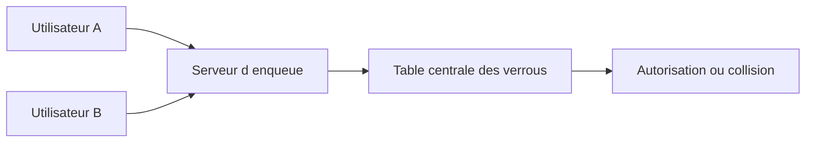

# 🌸 CONCEPT DE VERROUILLAGE SAP

## 🌺 OBJECTIFS

- Comprendre le rôle du verrouillage logique SAP
- Distinguer verrou SAP et verrou de base de données
- Prévenir les mises à jour concurrentes perdues

## 🌺 POURQUOI UN VERROU SAP

Une transaction interactive peut couvrir plusieurs écrans. Les verrous de base de données sont libérés à la fin de chaque database LUW ; ils ne peuvent donc pas protéger seuls l’ensemble de l’opération métier.

Le système SAP maintient une table centrale de verrous en mémoire. Chaque entrée décrit un objet métier, une clé, un propriétaire et un mode de verrouillage.

## 🌺 VERROU OPTIMISTE OU PESSIMISTE

- Un verrou pessimiste est pris avant la modification et empêche immédiatement un accès concurrent incompatible.
- Un verrou optimiste autorise d’abord plusieurs lecteurs, puis tente une conversion avant la sauvegarde.

## 🌺 RÈGLE

Verrouiller l’objet métier, pas seulement une instruction SQL. Le verrou doit couvrir la période comprise entre la lecture déterminante et la validation.

## 🌺 RÉFÉRENCES OFFICIELLES SAP

- [SAP Lock Concept — SAP Help Portal](https://help.sap.com/docs/ABAP_PLATFORM_NEW/7bbf03267f654b5cb06a8bf78f61fca1/9101274dc2e048d4b473fe5c45ae4e29.html)
- [Lock Table — SAP Help Portal](https://help.sap.com/docs/ABAP_PLATFORM_NEW/6568469cf5a1460a8d85c58b83d21ec2/47daae4038793c85e10000000a42189c.html)
- [Work Processes in Application Server ABAP — SAP Help Portal](https://help.sap.com/docs/ABAP_PLATFORM_NEW/e067931e0b0a4b2089f4db327879cd55/22d85d37ab534b86a5098ded38c06c0f.html)

---

➡️ [Chapitre suivant — CREER UN OBJET DE VERROUILLAGE AVEC SE11](<./07 - 🍧 CREER UN OBJET DE VERROUILLAGE AVEC SE11.md>)
