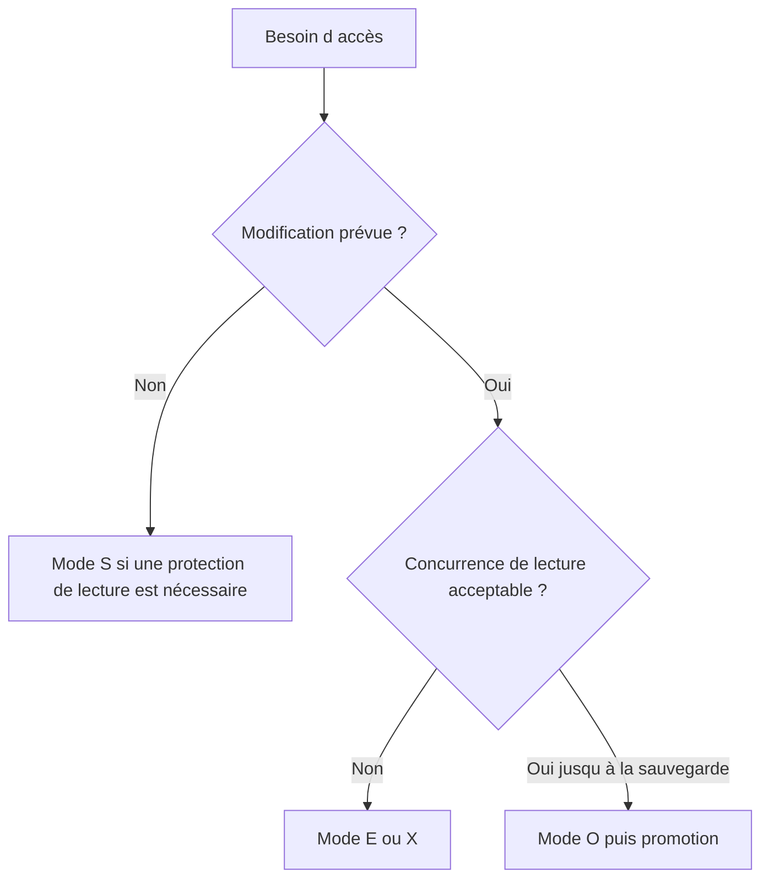

# 🌸 MODES DE VERROUILLAGE `S`, `E`, `X` ET `O`

## 🌺 OBJECTIFS

- Choisir un mode adapté au besoin
- Comprendre les collisions
- Éviter l’usage systématique d’un verrou exclusif trop fort

## 🌺 MODES PRINCIPAUX

| Mode | Signification           | Principe                                                                                      |
| ---- | ----------------------- | --------------------------------------------------------------------------------------------- |
| `S`  | Shared                  | Plusieurs propriétaires peuvent lire ; verrou incompatible avec une écriture exclusive        |
| `E`  | Exclusive cumulatif     | Lecture et écriture réservées au propriétaire ; le même propriétaire peut reprendre le verrou |
| `X`  | Exclusive non cumulatif | Verrou exclusif qui ne peut pas être repris une seconde fois par le même propriétaire         |
| `O`  | Optimistic              | Plusieurs propriétaires peuvent poser un verrou optimiste avant une tentative de promotion    |

## 🌺 CHOIX PRATIQUE

Le mode `E` est courant pour une modification métier classique. Le mode `X` doit être utilisé lorsque la non-cumulativité est réellement requise. Le verrou optimiste demande une conception explicite de la phase de promotion et du traitement des collisions.

## 🌺 CAS D’USAGE

Dans un contexte où plusieurs modifications liées doivent être validées ensemble et protégées contre les accès concurrents, le besoin consiste à **appliquer modes de verrouillage `s`, `e`, `x` et `o` dans une transaction cohérente et vérifier verrous, validation et annulation**. Cette notion est pertinente lorsque le lecteur doit pouvoir relier la syntaxe ou l’outil à une situation professionnelle concrète.

## 🌺 PROCÉDURE PAS À PAS

1. Lire la définition et identifier les prérequis du chapitre.
2. Choisir un objet Z ou un scénario de démonstration sans impact métier.
3. Reproduire l’exemple dans un système de développement et relever les données d’entrée.
4. Contrôler la syntaxe ou la configuration avant activation/exécution.
5. Comparer le résultat observé avec la section **Vérification**.
6. Documenter toute différence liée à la release, aux autorisations ou au paramétrage du système.

## 🌺 VÉRIFICATION

- Les données sont toutes validées ou toutes annulées selon le cas testé.
- Les verrous sont libérés à la fin du traitement normal et après erreur.
- Aucune update en erreur inattendue ne reste dans `SM13`.
- Les collisions concurrentes produisent un message contrôlé, pas une incohérence.

## 🌺 ERREURS FRÉQUENTES

- Supprimer manuellement un verrou sans comprendre son propriétaire.
- Relancer une update en erreur sans vérifier l’état métier.

## 🌺 TERMES DU LEXIQUE

- [SAP LUW](<../└─ 🧩 00 - LEXIQUE SAP ET ABAP/08 - 🍧 EXECUTION EXPLOITATION ET ADMINISTRATION.md#sap-luw>)
- [LUW base de données](<../└─ 🧩 00 - LEXIQUE SAP ET ABAP/08 - 🍧 EXECUTION EXPLOITATION ET ADMINISTRATION.md#luw-base>)
- [COMMIT WORK](<../└─ 🧩 00 - LEXIQUE SAP ET ABAP/08 - 🍧 EXECUTION EXPLOITATION ET ADMINISTRATION.md#commit-work>)
- [ROLLBACK WORK](<../└─ 🧩 00 - LEXIQUE SAP ET ABAP/08 - 🍧 EXECUTION EXPLOITATION ET ADMINISTRATION.md#rollback-work>)
- [Enqueue server](<../└─ 🧩 00 - LEXIQUE SAP ET ABAP/08 - 🍧 EXECUTION EXPLOITATION ET ADMINISTRATION.md#enqueue-server>)
- [Update task](<../└─ 🧩 00 - LEXIQUE SAP ET ABAP/08 - 🍧 EXECUTION EXPLOITATION ET ADMINISTRATION.md#update-task>)

## 🌺 À RETENIR

- À l’issue du chapitre, le lecteur sait **appliquer modes de verrouillage `s`, `e`, `x` et `o` dans une transaction cohérente et vérifier verrous, validation et annulation**.
- Toujours tester sur un objet Z ou un jeu de données sans impact avant d’intervenir sur un traitement réel.
- La documentation `F1` du système reste la référence pour la syntaxe disponible dans sa release.

## 🌺 RÉFÉRENCES OFFICIELLES SAP

- [SAP Lock Concept — SAP Help Portal](https://help.sap.com/docs/ABAP_PLATFORM_NEW/7bbf03267f654b5cb06a8bf78f61fca1/9101274dc2e048d4b473fe5c45ae4e29.html)
- [Function Modules for Lock Requests — SAP Help Portal](https://help.sap.com/docs/ABAP_PLATFORM_NEW/ec1c9c8191b74de98feb94001a95dd76/cf21eebf446011d189700000e8322d00.html)
- [Programming with Optimistic Locks — SAP Help Portal](https://help.sap.com/docs/ABAP_PLATFORM_NEW/6568469cf5a1460a8d85c58b83d21ec2/47dc35b35bc33b8be10000000a421937.html)

---

➡️ [Chapitre suivant — APPELER `ENQUEUE` ET TRAITER LES COLLISIONS](<./09 - 🍧 APPELER ENQUEUE ET TRAITER LES COLLISIONS.md>)
