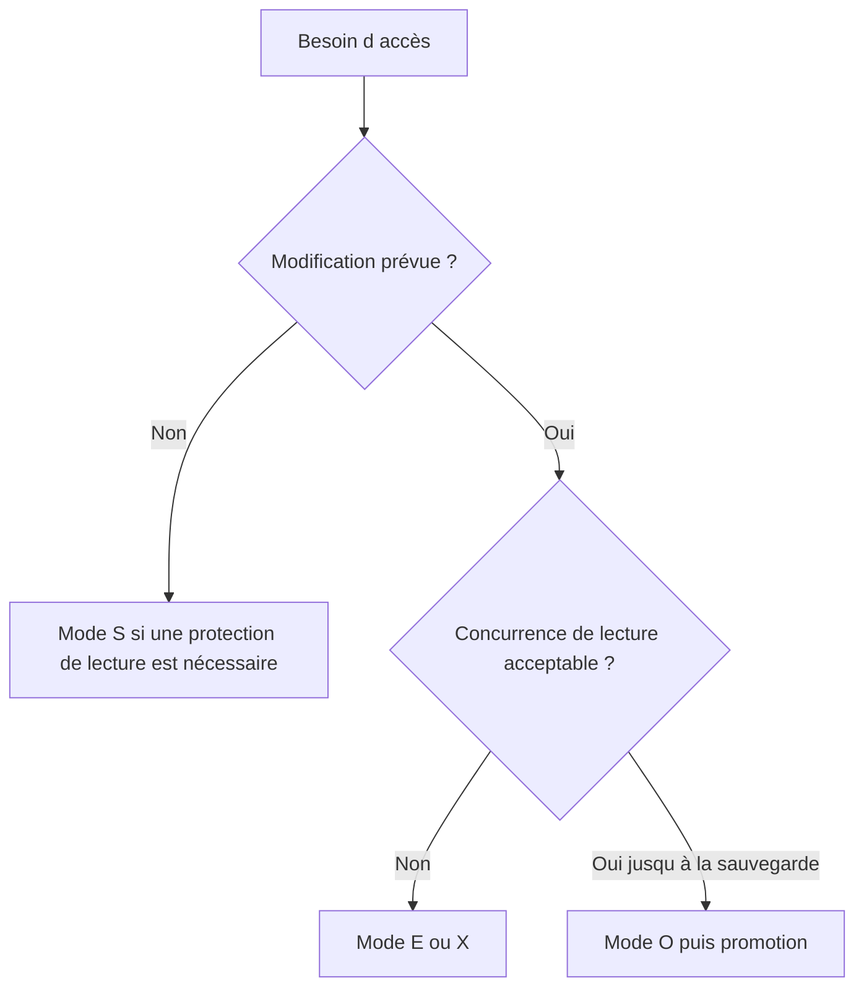

# 🌸 MODES DE VERROUILLAGE `S`, `E`, `X` ET `O`

## 🌺 OBJECTIFS

- Choisir un mode adapté au besoin
- Comprendre les collisions
- Éviter l’usage systématique d’un verrou exclusif trop fort

## 🌺 MODES PRINCIPAUX

| Mode | Signification           | Principe                                                                                      |
| ---- | ----------------------- | --------------------------------------------------------------------------------------------- |
| `S`  | Shared                  | Plusieurs propriétaires peuvent lire ; verrou incompatible avec une écriture exclusive        |
| `E`  | Exclusive cumulatif     | Lecture et écriture réservées au propriétaire ; le même propriétaire peut reprendre le verrou |
| `X`  | Exclusive non cumulatif | Verrou exclusif qui ne peut pas être repris une seconde fois par le même propriétaire         |
| `O`  | Optimistic              | Plusieurs propriétaires peuvent poser un verrou optimiste avant une tentative de promotion    |

## 🌺 CHOIX PRATIQUE

Le mode `E` est courant pour une modification métier classique. Le mode `X` doit être utilisé lorsque la non-cumulativité est réellement requise. Le verrou optimiste demande une conception explicite de la phase de promotion et du traitement des collisions.

## 🌺 RÉFÉRENCES OFFICIELLES SAP

- [SAP Lock Concept — SAP Help Portal](https://help.sap.com/docs/ABAP_PLATFORM_NEW/7bbf03267f654b5cb06a8bf78f61fca1/9101274dc2e048d4b473fe5c45ae4e29.html)
- [Function Modules for Lock Requests — SAP Help Portal](https://help.sap.com/docs/ABAP_PLATFORM_NEW/ec1c9c8191b74de98feb94001a95dd76/cf21eebf446011d189700000e8322d00.html)
- [Programming with Optimistic Locks — SAP Help Portal](https://help.sap.com/docs/ABAP_PLATFORM_NEW/6568469cf5a1460a8d85c58b83d21ec2/47dc35b35bc33b8be10000000a421937.html)

---

➡️ [Chapitre suivant — APPELER ENQUEUE ET TRAITER LES COLLISIONS](<./09 - 🍧 APPELER ENQUEUE ET TRAITER LES COLLISIONS.md>)
