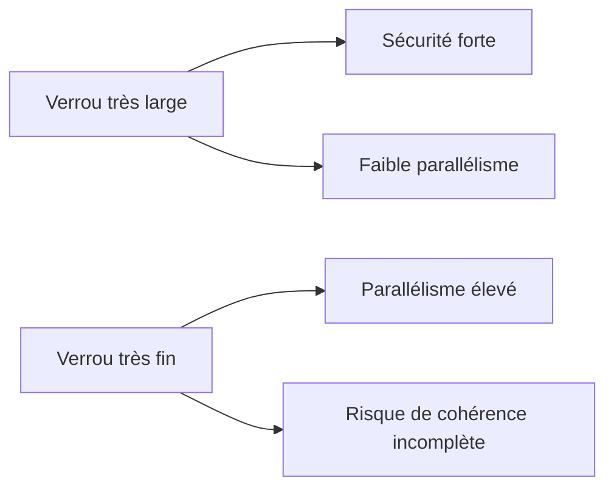

# 🌸 `_WAIT`, `_COLLECT` ET GRANULARITÉ DES VERROUS

## 🌺 OBJECTIFS

- Comprendre les paramètres techniques générés
- Éviter les attentes bloquantes non maîtrisées
- Réduire le nombre et la largeur des entrées de verrou

## 🌺 PARAMÈTRE `_WAIT`

`_WAIT` demande au système de répéter temporairement une demande qui rencontre une collision. Sans attente, l’appel retourne immédiatement `foreign_lock`.

Utiliser l’attente uniquement si :

- la durée attendue est courte ;
- l’utilisateur comprend pourquoi l’écran attend ;
- le traitement ne risque pas de bloquer en chaîne ;
- un message clair existe en cas d’échec final.

## 🌺 PARAMÈTRE `_COLLECT`

`_COLLECT` permet de placer la demande dans un conteneur local avant sa transmission groupée au service de verrouillage. Ce mécanisme est spécialisé et ne doit pas être activé sans besoin mesuré.

## 🌺 GRANULARITÉ

La bonne clé correspond à l’unité métier qui doit rester cohérente. Mesurer les collisions plutôt que réduire arbitrairement la portée.

## 🌺 RÉFÉRENCES OFFICIELLES SAP

- [Function Modules for Lock Requests — SAP Help Portal](https://help.sap.com/docs/ABAP_PLATFORM_NEW/ec1c9c8191b74de98feb94001a95dd76/cf21eebf446011d189700000e8322d00.html)
- [Frequently Asked Questions: Lock Concept — SAP Help Portal](https://help.sap.com/docs/ABAP_PLATFORM_BW4HANA/6568469cf5a1460a8d85c58b83d21ec2/47db6c1ae4282972e10000000a42189b.html)

---

➡️ [Chapitre suivant — ANALYSER LES VERROUS AVEC SM12](<./12 - 🍧 ANALYSER LES VERROUS AVEC SM12.md>)
