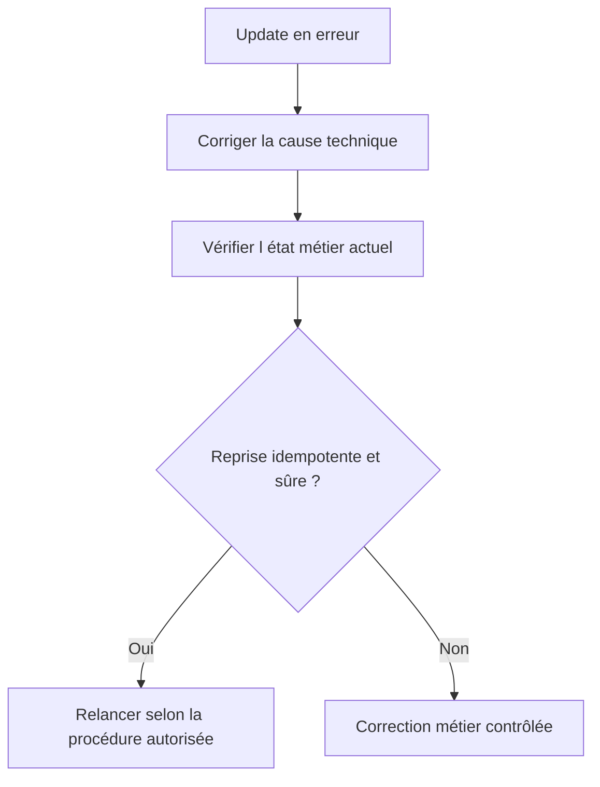

# 🌸 ANALYSER ET REPRENDRE LES UPDATES AVEC `SM13`

## 🌺 OBJECTIFS

- Rechercher une demande de mise à jour en erreur
- Identifier le module et la cause
- Décider si une reprise est sûre

## 🌺 RECHERCHE

Dans `SM13`, filtrer notamment par :

- utilisateur ;
- date et heure ;
- mandant ;
- statut ;
- transaction ou identifiant de demande.

Analyser ensuite :

- le module fonction en erreur ;
- le message ou le dump associé ;
- les paramètres enregistrés ;
- les modules V1 et V2 de la demande ;
- l’état actuel des données métier.

## 🌺 REPRISE

Ne pas relancer mécaniquement une demande ancienne. Les données ou le customizing peuvent avoir changé, et un traitement manuel peut avoir déjà compensé l’erreur.

## 🌺 OUTILS ASSOCIÉS

- `ST22` pour un dump du module de mise à jour ;
- `SM12` pour les verrous ;
- `SM21` pour le journal système ;
- `SLG1` si l’application écrit un journal applicatif ;
- `SM14` pour l’état administratif du système de mise à jour.

## 🌺 RÉFÉRENCES OFFICIELLES SAP

- [Update Management — SAP Help Portal](https://help.sap.com/docs/SAP_NETWEAVER_AS_ABAP_752/979cf1522d164bf7a781796efd8850ee/078cb02dc14d497f9779f7a309c1a7bc.html)
- [Update Statuses — SAP Help Portal](https://help.sap.com/docs/ABAP_PLATFORM_NEW/979cf1522d164bf7a781796efd8850ee/3c7ad8b964b74aac9e1d3e709b33e794.html)
- [SM13 - Update Request — SAP Help Portal](https://help.sap.com/docs/SUPPORT_CONTENT/basis/3354611548.html)

---

➡️ [Chapitre suivant — CONCEPTION DIAGNOSTIC ET BONNES PRATIQUES](<./20 - 🍧 CONCEPTION DIAGNOSTIC ET BONNES PRATIQUES.md>)
