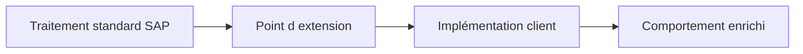

# 🌸 PRINCIPES D’EXTENSION DU STANDARD SAP

## 🌺 OBJECTIFS

- Distinguer extension, paramétrage et modification
- Comprendre pourquoi une extension doit rester séparée du code SAP
- Identifier les critères de choix d’une technique

## 🌺 BESOIN D’EXTENSION

Une extension ajoute ou adapte un comportement sans modifier directement l’objet Repository livré par SAP. Le code client est conservé dans un objet distinct, relié à un point prévu par SAP ou par l’Enhancement Framework.

## 🌺 EXTENSION OU MODIFICATION

| Approche                  | Effet sur le standard                                 | Risque de maintenance |
| ------------------------- | ----------------------------------------------------- | --------------------- |
| Customizing               | Aucun code modifié                                    | Faible                |
| Extension publiée par SAP | Code client séparé                                    | Maîtrisé              |
| Enhancement implicite     | Code client séparé mais fortement lié à l’emplacement | Plus élevé            |
| Modification directe      | Objet SAP modifié                                     | Élevé                 |

Une modification directe nécessite une clé de modification, crée un écart avec la version SAP et doit être ajustée lors des mises à niveau. Elle ne doit être retenue qu’après absence démontrée de solution standard ou d’extension.

## 🌺 PRINCIPES DE CONCEPTION

- privilégier le paramétrage avant le code ;
- rechercher une API ou un point d’extension publié ;
- limiter l’implémentation à l’orchestration ;
- placer la logique métier dans une classe client testable ;
- ne pas exécuter de `COMMIT WORK` dans un exit sans contrat explicite ;
- documenter le point d’appel, le contexte et les effets de bord ;
- tester l’activation et la désactivation de l’extension.

## 🌺 RÉFÉRENCES OFFICIELLES SAP

- [ABAP: Enhancement Concepts — SAP Help Portal](https://help.sap.com/docs/ABAP_PLATFORM_NEW/7bfe8cdcfbb040dcb6702dada8c3e2f0/f17cdbf76d1f4cb8805ed69891eafdd9.html)
- [Enhancement Framework — SAP Help Portal](https://help.sap.com/docs/SAP_S4HANA_ON-PREMISE/e322becd165844e5868e590bc8efafaf/949cdc40132a8531e10000000a1550b0.html)
- [Enhancement Technologies — SAP Help Portal](https://help.sap.com/docs/ABAP_PLATFORM_NEW/46a2cfc13d25463b8b9a3d2a3c3ba0d9/7063da4023a28631e10000000a1550b0.html)

---

➡️ [Chapitre suivant — CHOISIR UNE TECHNOLOGIE D EXTENSION](<./02 - 🍧 CHOISIR UNE TECHNOLOGIE D EXTENSION.md>)
