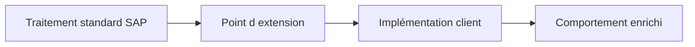

# 🌸 PRINCIPES D’EXTENSION DU STANDARD SAP

## 🌺 OBJECTIFS

- Distinguer extension, paramétrage et modification
- Comprendre pourquoi une extension doit rester séparée du code SAP
- Identifier les critères de choix d’une technique

## 🌺 BESOIN D’EXTENSION

Une extension ajoute ou adapte un comportement sans modifier directement l’objet Repository livré par SAP. Le code client est conservé dans un objet distinct, relié à un point prévu par SAP ou par l’Enhancement Framework.



## 🌺 EXTENSION OU MODIFICATION

| Approche                  | Effet sur le standard                                 | Risque de maintenance |
| ------------------------- | ----------------------------------------------------- | --------------------- |
| Customizing               | Aucun code modifié                                    | Faible                |
| Extension publiée par SAP | Code client séparé                                    | Maîtrisé              |
| Enhancement implicite     | Code client séparé mais fortement lié à l’emplacement | Plus élevé            |
| Modification directe      | Objet SAP modifié                                     | Élevé                 |

Une modification directe nécessite une clé de modification, crée un écart avec la version SAP et doit être ajustée lors des mises à niveau. Elle ne doit être retenue qu’après absence démontrée de solution standard ou d’extension.

## 🌺 PRINCIPES DE CONCEPTION

- privilégier le paramétrage avant le code ;
- rechercher une API ou un point d’extension publié ;
- limiter l’implémentation à l’orchestration ;
- placer la logique métier dans une classe client testable ;
- ne pas exécuter de `COMMIT WORK` dans un exit sans contrat explicite ;
- documenter le point d’appel, le contexte et les effets de bord ;
- tester l’activation et la désactivation de l’extension.

## 🌺 CAS D’USAGE

Dans un contexte où un besoin client doit compléter le comportement standard SAP sans modifier directement le code livré par SAP, le besoin consiste à **utiliser principes d’extension du standard sap pour étendre le standard sans créer de modification directe ni d’effet de bord hors périmètre**. Cette notion est pertinente lorsque le choix technique doit être compris avant d’appliquer une procédure.

## 🌺 PROCÉDURE PAS À PAS

1. Saisir `/nSE80`.
2. Sélectionner le type d’objet ou le package dans la liste de gauche.
3. Entrer le nom technique puis valider.
4. Commencer en mode **Afficher** pour analyser l’objet et ses sous-objets.
5. Passer en modification uniquement dans un système et un objet autorisés.
6. Contrôler la syntaxe, activer les objets modifiés puis vérifier leur statut actif.

## 🌺 VÉRIFICATION

- L’implémentation ou le projet est actif et transporté dans le bon ordre.
- Un breakpoint confirme que le point d’extension est appelé dans le scénario visé.
- Le comportement standard reste inchangé hors du périmètre fonctionnel prévu.
- Aucune modification directe d’un objet SAP standard n’a été créée.

## 🌺 ERREURS FRÉQUENTES

- Choisir le premier exit trouvé sans vérifier le moment exact de l’appel.
- Créer plusieurs implémentations concurrentes sans règles de filtre.

## 🌺 FICHE DE CONTRÔLE À COPIER

```text
Système / SID       :
Mandant             :
Utilisateur         :
Transaction / outil :
Objet technique     :
Jeu de données      :
Résultat attendu    :
Résultat observé    :
Horodatage          :
Ordre de transport  :
```

## 🌺 TERMES DU LEXIQUE

- [BAdI](<../└─ 🧩 00 - LEXIQUE SAP ET ABAP/10 - 🍧 ACRONYMES SAP.md#acro-badi>)
- [BTE](<../└─ 🧩 00 - LEXIQUE SAP ET ABAP/10 - 🍧 ACRONYMES SAP.md#acro-bte>)
- [Objet Repository](<../└─ 🧩 00 - LEXIQUE SAP ET ABAP/03 - 🍧 REPOSITORY PACKAGES ET TRANSPORTS.md#objet-repository>)

## 🌺 À RETENIR

- À l’issue du chapitre, le lecteur sait **utiliser principes d’extension du standard sap pour étendre le standard sans créer de modification directe ni d’effet de bord hors périmètre**.
- Toujours tester sur un objet Z ou un jeu de données sans impact avant d’intervenir sur un traitement réel.
- La documentation `F1` du système reste la référence pour la syntaxe disponible dans sa release.

## 🌺 RÉFÉRENCES OFFICIELLES SAP

- [ABAP: Enhancement Concepts — SAP Help Portal](https://help.sap.com/docs/ABAP_PLATFORM_NEW/7bfe8cdcfbb040dcb6702dada8c3e2f0/f17cdbf76d1f4cb8805ed69891eafdd9.html)
- [Enhancement Framework — SAP Help Portal](https://help.sap.com/docs/SAP_S4HANA_ON-PREMISE/e322becd165844e5868e590bc8efafaf/949cdc40132a8531e10000000a1550b0.html)
- [Enhancement Technologies — SAP Help Portal](https://help.sap.com/docs/ABAP_PLATFORM_NEW/46a2cfc13d25463b8b9a3d2a3c3ba0d9/7063da4023a28631e10000000a1550b0.html)


---

➡️ [Chapitre suivant — CHOISIR UNE TECHNOLOGIE D’EXTENSION](<./02 - 🍧 CHOISIR UNE TECHNOLOGIE D EXTENSION.md>)
