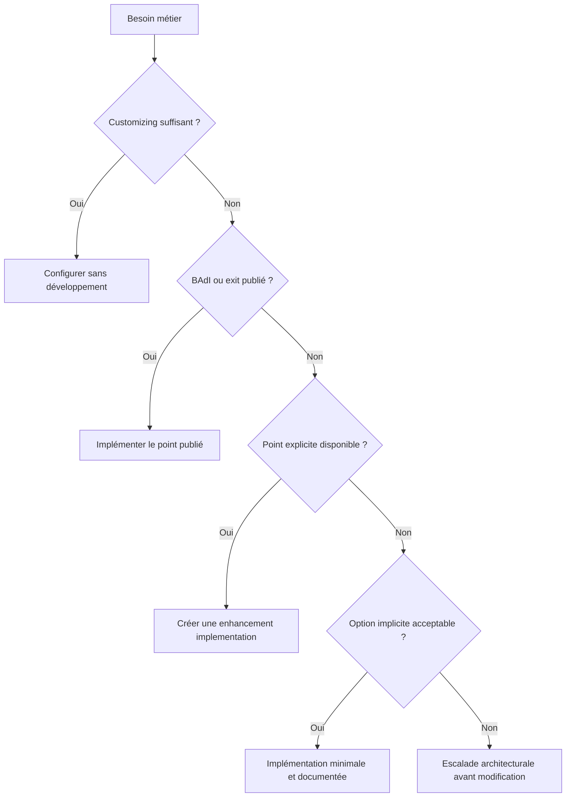

# 🌸 CHOISIR UNE TECHNOLOGIE D’EXTENSION

## 🌺 OBJECTIFS

- Choisir la technologie la plus stable disponible
- Éviter l’utilisation d’un enhancement implicite lorsqu’une extension publiée existe
- Situer les technologies historiques

## 🌺 ORDRE DE RECHERCHE

## 🌺 MATRICE DE CHOIX

| Technologie                   | Utilisation principale                               | Outil SAP GUI          |
| ----------------------------- | ---------------------------------------------------- | ---------------------- |
| Customer exit                 | Extensions classiques fournies par SAP               | `SMOD`, `CMOD`         |
| BAdI classique                | Extension orientée objet historique                  | `SE18`, `SE19`         |
| BAdI du Enhancement Framework | Extension orientée objet intégrée au framework       | `SE18`, `SE19`, `SE80` |
| Enhancement point ou section  | Insertion ou remplacement à un point explicite       | Éditeur ABAP, `SE80`   |
| Option implicite              | Insertion à un emplacement systématique              | Éditeur ABAP           |
| BTE                           | Extension événementielle, fréquente en FI            | `FIBF`                 |
| User exit codé                | Routine historique nommée dans un programme standard | `SE38`, `SE80`         |

## 🌺 CRITÈRES

Évaluer systématiquement :

- stabilité du contrat ;
- possibilité de plusieurs implémentations ;
- filtrage disponible ;
- contexte transactionnel ;
- fréquence d’appel ;
- volume de données ;
- dépendance à une ligne précise du standard ;
- comportement après upgrade ;
- possibilité de désactivation rapide.

## 🌺 RÉFÉRENCES OFFICIELLES SAP

- [Enhancement Technologies — SAP Help Portal](https://help.sap.com/docs/ABAP_PLATFORM_NEW/46a2cfc13d25463b8b9a3d2a3c3ba0d9/7063da4023a28631e10000000a1550b0.html)
- [Enhancement Framework — SAP Help Portal](https://help.sap.com/docs/SAP_S4HANA_ON-PREMISE/e322becd165844e5868e590bc8efafaf/949cdc40132a8531e10000000a1550b0.html)
- [Customer Exits — SAP Help Portal](https://help.sap.com/docs/ABAP_PLATFORM_NEW/2b28ffa716c24348903f8ffbfeb81df8/c81975cc43b111d1896f0000e8322d00.html)

---

➡️ [Chapitre suivant — RECHERCHER UN POINT D EXTENSION](<./03 - 🍧 RECHERCHER UN POINT D EXTENSION.md>)
