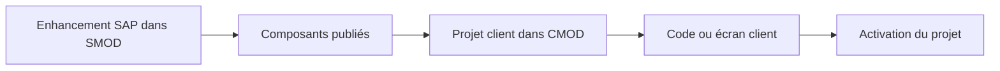

# 🌸 CUSTOMER EXITS ET ENHANCEMENTS CLASSIQUES

## 🌺 OBJECTIFS

- Comprendre le modèle `SMOD` / `CMOD`
- Distinguer définition SAP et projet client
- Identifier les composants d’un enhancement classique

## 🌺 ARCHITECTURE

SAP définit l’enhancement et ses composants. Le client crée un projet `CMOD`, lui affecte un ou plusieurs enhancements, implémente les composants puis active le projet.

## 🌺 TYPES DE COMPOSANTS

- function module exit ;
- screen exit ;
- menu exit ;
- extensions de données associées selon l’application.

Un enhancement classique peut regrouper plusieurs composants qui doivent être analysés ensemble.

## 🌺 ACTIVATION

Le code présent dans un include client ne suffit pas. Le projet `CMOD` contenant l’enhancement doit être actif. Une seule implémentation active est normalement attendue pour un enhancement classique donné.

## 🌺 LIMITES

- technologie historique ;
- contrat souvent moins flexible qu’un BAdI ;
- dépendance à des programmes, écrans ou groupes de fonctions précis ;
- pas de filtrage générique comparable aux BAdI ;
- plusieurs besoins peuvent devoir être regroupés dans le même projet ou composant.

## 🌺 RÉFÉRENCES OFFICIELLES SAP

- [Customer Exits — SAP Help Portal](https://help.sap.com/docs/ABAP_PLATFORM_NEW/2b28ffa716c24348903f8ffbfeb81df8/c81975cc43b111d1896f0000e8322d00.html)
- [Customer Exit Glossary — SAP Help Portal](https://help.sap.com/saphelp_snc700_ehp01/helpdata/en/35/26b1b7afab52b9e10000009b38f974/content.htm)
- [Types of Exits — SAP Help Portal](https://help.sap.com/docs/ABAP_PLATFORM_NEW/2b28ffa716c24348903f8ffbfeb81df8/c81975e643b111d1896f0000e8322d00.html)

---

➡️ [Chapitre suivant — ANALYSER UN ENHANCEMENT AVEC SMOD](<./06 - 🍧 ANALYSER UN ENHANCEMENT AVEC SMOD.md>)
