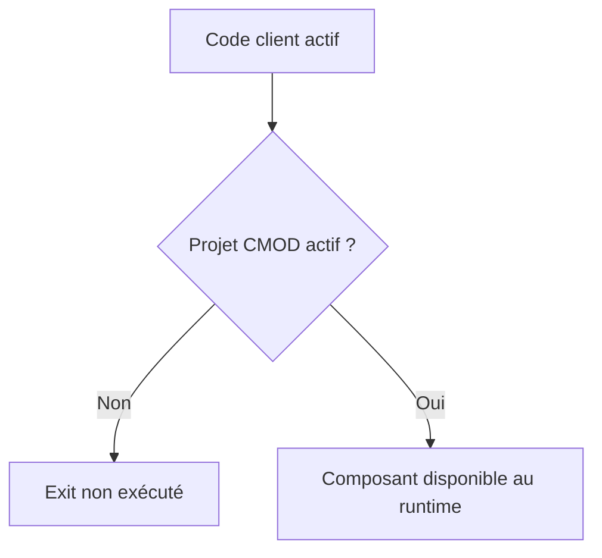

# 🌸 CRÉER ET ACTIVER UN PROJET `CMOD`

## 🌺 OBJECTIFS

- Créer un projet d’extension client
- Affecter un enhancement `SMOD`
- Implémenter, transporter et activer le projet

## 🌺 PROCÉDURE

1. Ouvrir `CMOD`.
2. Créer un projet client avec une description explicite.
3. Affecter le projet à un package et à un ordre de transport.
4. Ajouter l’enhancement identifié dans `SMOD`.
5. Ouvrir les composants.
6. Implémenter les includes, écrans ou fonctions prévus.
7. Activer les objets techniques.
8. Activer le projet `CMOD`.
9. Tester le scénario métier complet.

## 🌺 NOMMAGE

Utiliser les conventions du client pour le projet, les classes déléguées et les objets DDIC. Le nom du projet doit permettre d’identifier le domaine fonctionnel et le besoin, sans reprendre un nom générique tel que `ZTEST`.

## 🌺 ACTIVATION

Vérifier les deux niveaux : activation des objets ABAP et activation du projet.

## 🌺 TRANSPORT

Le projet `CMOD`, les includes client, les classes déléguées, les écrans et les objets DDIC doivent être transportés dans un ordre cohérent. Contrôler les dépendances entre Workbench et Customizing lorsque l’extension utilise aussi du paramétrage.

## 🌺 RÉFÉRENCES OFFICIELLES SAP

- [Customer Exits — SAP Help Portal](https://help.sap.com/docs/ABAP_PLATFORM_NEW/2b28ffa716c24348903f8ffbfeb81df8/c81975cc43b111d1896f0000e8322d00.html)
- [Activating User Exits — SAP Help Portal](https://help.sap.com/docs/SAP_S4HANA_ON-PREMISE/83f4631d77654e14800e31b17fe9bd45/4c3a1afc9995677ae10000000a42189b.html)
- [Customer Exit Glossary — SAP Help Portal](https://help.sap.com/saphelp_snc700_ehp01/helpdata/en/35/26b1b7afab52b9e10000009b38f974/content.htm)

---

➡️ [Chapitre suivant — FUNCTION MODULE EXITS](<./08 - 🍧 FUNCTION MODULE EXITS.md>)
