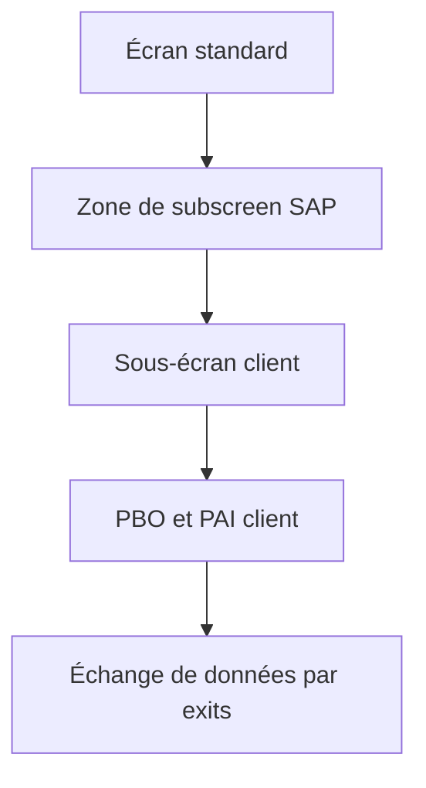

# 🌸 SCREEN EXITS

## 🌺 OBJECTIFS

- Ajouter un sous-écran client à un écran standard prévu par SAP
- Comprendre le flux de données entre programme standard et sous-écran
- Coordonner Dynpro, DDIC et function exits

## 🌺 ARCHITECTURE

SAP place une zone de sous-écran dans le Dynpro standard. Le client crée le sous-écran dans le programme ou groupe de fonctions prévu par le composant.

## 🌺 ÉTAPES

1. Identifier le screen exit dans `SMOD`.
2. Créer ou ouvrir le projet `CMOD`.
3. Créer le sous-écran avec le numéro attendu.
4. Ajouter les champs et éléments DDIC nécessaires.
5. Implémenter le PBO et le PAI.
6. Utiliser les function exits associés pour transférer les données.
7. Activer le sous-écran, les includes et le projet.
8. Tester création, modification, affichage et annulation.

## 🌺 POINTS DE VIGILANCE

- le sous-écran ne possède pas de GUI status autonome ;
- la navigation doit respecter le flux du Dynpro principal ;
- les champs doivent être initialisés à chaque affichage pertinent ;
- le PAI ne doit pas persister les données indépendamment du standard ;
- les champs ajoutés peuvent nécessiter une append structure et une logique de sauvegarde.

## 🌺 RÉFÉRENCES OFFICIELLES SAP

- [Types of Exits — SAP Help Portal](https://help.sap.com/docs/ABAP_PLATFORM_NEW/2b28ffa716c24348903f8ffbfeb81df8/c81975e643b111d1896f0000e8322d00.html)
- [Customer Exits — SAP Help Portal](https://help.sap.com/docs/ABAP_PLATFORM_NEW/2b28ffa716c24348903f8ffbfeb81df8/c81975cc43b111d1896f0000e8322d00.html)
- [Enhancement Technologies — SAP Help Portal](https://help.sap.com/docs/ABAP_PLATFORM_NEW/46a2cfc13d25463b8b9a3d2a3c3ba0d9/7063da4023a28631e10000000a1550b0.html)

---

➡️ [Chapitre suivant — MENU EXITS](<./10 - 🍧 MENU EXITS.md>)
