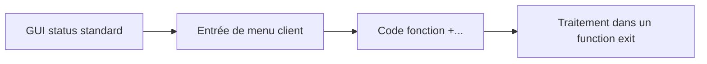

# 🌸 MENU EXITS

## 🌺 OBJECTIFS

- Ajouter une entrée de menu ou une fonction à une transaction standard
- Implémenter le traitement associé
- Contrôler disponibilité et autorisations

## 🌺 PRINCIPE

Un menu exit permet d’ajouter une fonction à un GUI status prévu par SAP. Les codes fonction des menu exits sont généralement définis par SAP et commencent par `+`.

## 🌺 IMPLÉMENTATION

- identifier le menu exit dans `SMOD` ;
- affecter l’enhancement au projet `CMOD` ;
- maintenir le texte de l’entrée ;
- implémenter le traitement dans le composant prévu ;
- vérifier les autorisations avant l’action ;
- gérer les contextes où l’action n’est pas disponible.

## 🌺 BONNES PRATIQUES

- masquer ou désactiver l’action lorsqu’elle n’est pas pertinente ;
- ne pas détourner un code fonction standard ;
- afficher un texte court et non ambigu ;
- réutiliser une transaction ou une classe de service existante ;
- tester les langues de connexion utilisées ;
- contrôler le retour vers l’écran standard.

## 🌺 RÉFÉRENCES OFFICIELLES SAP

- [Types of Exits — SAP Help Portal](https://help.sap.com/docs/ABAP_PLATFORM_NEW/2b28ffa716c24348903f8ffbfeb81df8/c81975e643b111d1896f0000e8322d00.html)
- [Enhancements, User Exits and Customer Exits — SAP Help Portal](https://help.sap.com/docs/btp/ABAP/3353526313.html)

---

➡️ [Chapitre suivant — EXTENSIONS DDIC ASSOCIEES AUX EXITS](<./11 - 🍧 EXTENSIONS DDIC ASSOCIEES AUX EXITS.md>)
