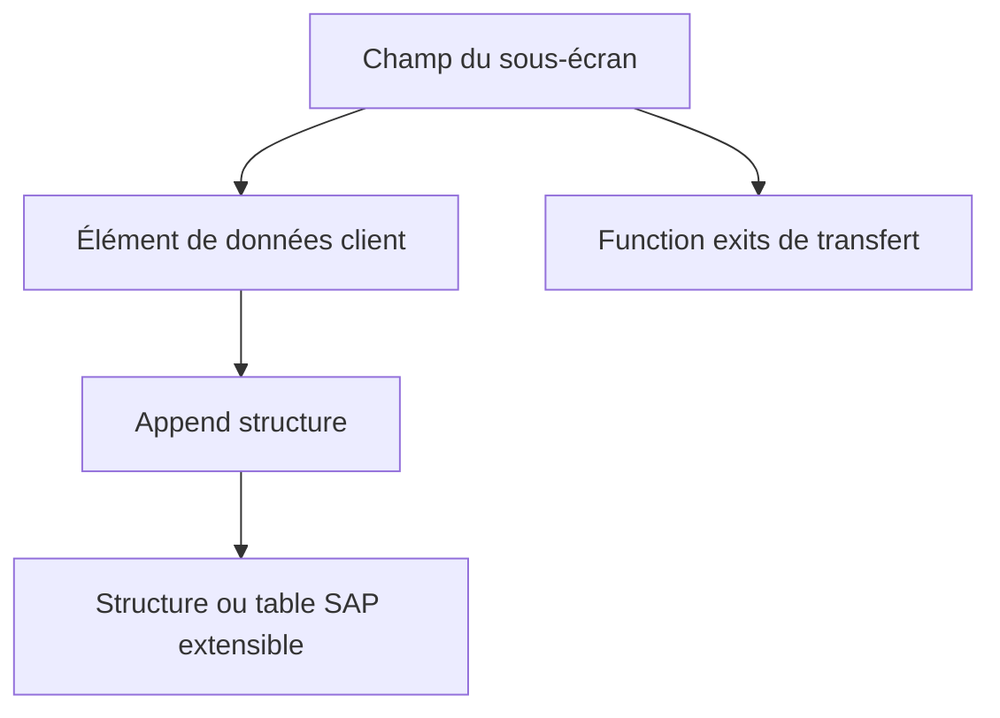

# 🌸 EXTENSIONS DDIC ASSOCIÉES AUX EXITS

## 🌺 OBJECTIFS

- Relier un champ client à une extension applicative
- Utiliser append structures et éléments de données sans modifier la table SAP
- Organiser le transport des dépendances

## 🌺 CAS CLASSIQUE

Un screen exit affiche un champ client. La persistance peut nécessiter :

- un élément de données client ;
- un domaine client ;
- une append structure sur une structure ou table extensible ;
- un sous-écran ;
- des function exits pour l’alimentation et la sauvegarde.



## 🌺 RÈGLES

- utiliser les mécanismes d’append prévus par le Dictionary ;
- ne pas ajouter un champ directement dans une table SAP ;
- vérifier les catégories d’extension autorisées ;
- respecter le namespace client ;
- ne pas supposer que l’ajout DDIC entraîne automatiquement l’affichage ou la sauvegarde ;
- analyser les impacts sur les structures, interfaces, IDoc et extractions.

## 🌺 TRANSPORT

Transporter dans un ordre cohérent :

1. domaine et élément de données ;
2. append structure ;
3. sous-écran et code ;
4. projet ou implémentation d’extension ;
5. paramétrage éventuel.

## 🌺 CAS D’USAGE

Dans un contexte où un besoin client doit compléter le comportement standard SAP sans modifier directement le code livré par SAP, le besoin consiste à **utiliser extensions ddic associées aux exits pour étendre le standard sans créer de modification directe ni d’effet de bord hors périmètre**. Cette notion est pertinente lorsque le lecteur doit pouvoir relier la syntaxe ou l’outil à une situation professionnelle concrète.

## 🌺 PROCÉDURE PAS À PAS

1. Saisir `/nSE80`.
2. Sélectionner le type d’objet ou le package dans la liste de gauche.
3. Entrer le nom technique puis valider.
4. Commencer en mode **Afficher** pour analyser l’objet et ses sous-objets.
5. Passer en modification uniquement dans un système et un objet autorisés.
6. Contrôler la syntaxe, activer les objets modifiés puis vérifier leur statut actif.

## 🌺 VÉRIFICATION

- L’implémentation ou le projet est actif et transporté dans le bon ordre.
- Un breakpoint confirme que le point d’extension est appelé dans le scénario visé.
- Le comportement standard reste inchangé hors du périmètre fonctionnel prévu.
- Aucune modification directe d’un objet SAP standard n’a été créée.

## 🌺 ERREURS FRÉQUENTES

- Choisir le premier exit trouvé sans vérifier le moment exact de l’appel.
- Créer plusieurs implémentations concurrentes sans règles de filtre.

## 🌺 FICHE DE CONTRÔLE À COPIER

```text
Système / SID       :
Mandant             :
Utilisateur         :
Transaction / outil :
Objet technique     :
Jeu de données      :
Résultat attendu    :
Résultat observé    :
Horodatage          :
Ordre de transport  :
```

## 🌺 TERMES DU LEXIQUE

- [DDIC](<../└─ 🧩 00 - LEXIQUE SAP ET ABAP/10 - 🍧 ACRONYMES SAP.md#acro-ddic>)
- [BAdI](<../└─ 🧩 00 - LEXIQUE SAP ET ABAP/10 - 🍧 ACRONYMES SAP.md#acro-badi>)
- [BTE](<../└─ 🧩 00 - LEXIQUE SAP ET ABAP/10 - 🍧 ACRONYMES SAP.md#acro-bte>)
- [Objet Repository](<../└─ 🧩 00 - LEXIQUE SAP ET ABAP/03 - 🍧 REPOSITORY PACKAGES ET TRANSPORTS.md#objet-repository>)

## 🌺 À RETENIR

- À l’issue du chapitre, le lecteur sait **utiliser extensions ddic associées aux exits pour étendre le standard sans créer de modification directe ni d’effet de bord hors périmètre**.
- Toujours tester sur un objet Z ou un jeu de données sans impact avant d’intervenir sur un traitement réel.
- La documentation `F1` du système reste la référence pour la syntaxe disponible dans sa release.

## 🌺 RÉFÉRENCES OFFICIELLES SAP

- [Enhancement Technologies — SAP Help Portal](https://help.sap.com/docs/ABAP_PLATFORM_NEW/46a2cfc13d25463b8b9a3d2a3c3ba0d9/7063da4023a28631e10000000a1550b0.html)
- [Enhancement Framework — SAP Help Portal](https://help.sap.com/docs/SAP_S4HANA_ON-PREMISE/e322becd165844e5868e590bc8efafaf/949cdc40132a8531e10000000a1550b0.html)
- [Types of Exits — SAP Help Portal](https://help.sap.com/docs/ABAP_PLATFORM_NEW/2b28ffa716c24348903f8ffbfeb81df8/c81975e643b111d1896f0000e8322d00.html)


---

➡️ [Chapitre suivant — FIELD EXITS ET TECHNOLOGIES HISTORIQUES](<./12 - 🍧 FIELD EXITS ET TECHNOLOGIES HISTORIQUES.md>)
