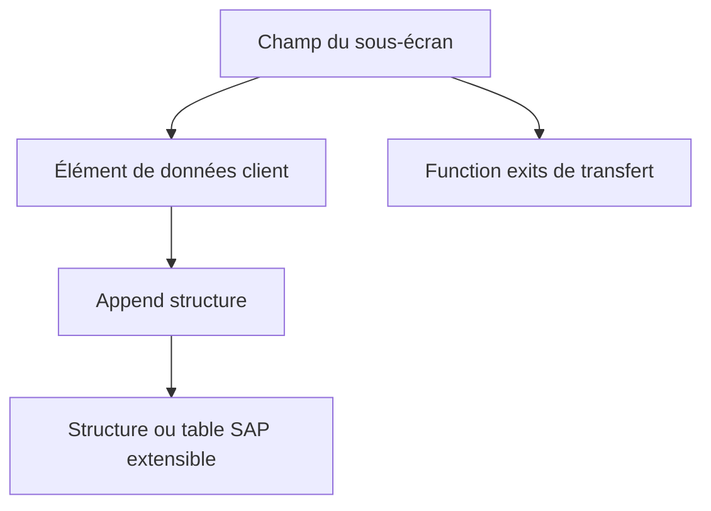

# 🌸 EXTENSIONS DDIC ASSOCIÉES AUX EXITS

## 🌺 OBJECTIFS

- Relier un champ client à une extension applicative
- Utiliser append structures et éléments de données sans modifier la table SAP
- Organiser le transport des dépendances

## 🌺 CAS CLASSIQUE

Un screen exit affiche un champ client. La persistance peut nécessiter :

- un élément de données client ;
- un domaine client ;
- une append structure sur une structure ou table extensible ;
- un sous-écran ;
- des function exits pour l’alimentation et la sauvegarde.

## 🌺 RÈGLES

- utiliser les mécanismes d’append prévus par le Dictionary ;
- ne pas ajouter un champ directement dans une table SAP ;
- vérifier les catégories d’extension autorisées ;
- respecter le namespace client ;
- ne pas supposer que l’ajout DDIC entraîne automatiquement l’affichage ou la sauvegarde ;
- analyser les impacts sur les structures, interfaces, IDoc et extractions.

## 🌺 TRANSPORT

Transporter dans un ordre cohérent :

1. domaine et élément de données ;
2. append structure ;
3. sous-écran et code ;
4. projet ou implémentation d’extension ;
5. paramétrage éventuel.

## 🌺 RÉFÉRENCES OFFICIELLES SAP

- [Enhancement Technologies — SAP Help Portal](https://help.sap.com/docs/ABAP_PLATFORM_NEW/46a2cfc13d25463b8b9a3d2a3c3ba0d9/7063da4023a28631e10000000a1550b0.html)
- [Enhancement Framework — SAP Help Portal](https://help.sap.com/docs/SAP_S4HANA_ON-PREMISE/e322becd165844e5868e590bc8efafaf/949cdc40132a8531e10000000a1550b0.html)
- [Types of Exits — SAP Help Portal](https://help.sap.com/docs/ABAP_PLATFORM_NEW/2b28ffa716c24348903f8ffbfeb81df8/c81975e643b111d1896f0000e8322d00.html)

---

➡️ [Chapitre suivant — FIELD EXITS ET TECHNOLOGIES HISTORIQUES](<./12 - 🍧 FIELD EXITS ET TECHNOLOGIES HISTORIQUES.md>)
