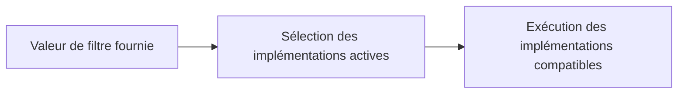

# 🌸 BAdI CLASSIQUES, FILTRES ET USAGE MULTIPLE

## 🌺 OBJECTIFS

- Maintenir une implémentation de BAdI classique
- Comprendre la sélection par filtre
- Anticiper l’ordre et la multiplicité des appels

## 🌺 BAdI CLASSIQUE

Les BAdI classiques utilisent le modèle historique du BAdI Builder. Ils restent fréquents dans les applications ECC et certains composants S/4HANA. Depuis AS ABAP 7.0, SAP distingue les BAdI classiques des BAdI intégrés au Enhancement Framework.

## 🌺 FILTRES

Une définition filter-dependent sélectionne une ou plusieurs implémentations selon une valeur fournie par l’application. L’implémentation doit maintenir les valeurs de filtre qu’elle prend en charge.

Ne pas coder dans la méthode une seconde logique de sélection qui duplique inutilement le filtre configuré.

## 🌺 USAGE MULTIPLE

Avec multiple-use, plusieurs implémentations peuvent être exécutées. Le code ne doit pas dépendre d’un ordre non garanti, sauf contrat explicite de l’application.

Éviter :

- plusieurs implémentations modifiant la même donnée sans coordination ;
- un état global partagé ;
- des commits dans une implémentation ;
- une dépendance au nom technique d’une autre implémentation.

## 🌺 DIAGNOSTIC

- afficher les implémentations actives dans `SE18` ou `SE19` ;
- vérifier les valeurs de filtre ;
- placer un breakpoint dans chaque classe candidate ;
- contrôler la multiplicité et l’ordre observé ;
- mesurer le temps si le BAdI est appelé dans une boucle.

## 🌺 RÉFÉRENCES OFFICIELLES SAP

- [Classic BAdIs — SAP Help Portal](https://help.sap.com/docs/ABAP_PLATFORM_NEW/2b28ffa716c24348903f8ffbfeb81df8/e6d54d3c596f0b26e10000000a11402f.html)
- [Implementing a Filter-Dependent Classic BAdI — SAP Help Portal](https://help.sap.com/docs/ABAP_PLATFORM_2020/2b28ffa716c24348903f8ffbfeb81df8/9790e24662d6d8478cf1f392108c5df0.html)
- [How to Use Filters — SAP Help Portal](https://help.sap.com/docs/ABAP_PLATFORM_NEW/46a2cfc13d25463b8b9a3d2a3c3ba0d9/44f6cd83912541aae10000000a114a6b.html)

---

➡️ [Chapitre suivant — ENHANCEMENT SPOTS ET IMPLEMENTATIONS](<./17 - 🍧 ENHANCEMENT SPOTS ET IMPLEMENTATIONS.md>)
