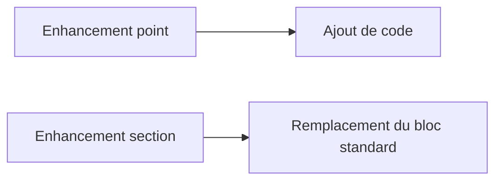

# 🌸 POINTS D’ENHANCEMENT EXPLICITES

## 🌺 OBJECTIFS

- Distinguer `ENHANCEMENT-POINT` et `ENHANCEMENT-SECTION`
- Créer un source code plug-in sur une option publiée
- Évaluer le risque d’un remplacement de section

## 🌺 ENHANCEMENT POINT

Un point explicite désigne une position où le code d’une implémentation est ajouté.

Définition côté fournisseur :

```abap
ENHANCEMENT-POINT ep_validate SPOTS es_demo.
```

Implémentation client affichée dans l’éditeur :

```abap
ENHANCEMENT 1 zdev_validate.
  zcl_dev_extension=>validate( ).
ENDENHANCEMENT.
```

## 🌺 ENHANCEMENT SECTION

Une section explicite encadre un bloc standard qui peut être remplacé par l’implémentation. Le code client ne complète pas le bloc : il le substitue.



Le remplacement augmente le risque de perdre des corrections ou évolutions apportées ultérieurement au bloc standard. Il doit être justifié et revu lors des upgrades.

## 🌺 STATIC ET DYNAMIC

Certaines options sont statiques et interviennent dans les parties déclaratives ; d’autres sont dynamiques et interviennent dans le flux d’exécution. Respecter le contexte syntaxique de l’option.

## 🌺 RÉFÉRENCES OFFICIELLES SAP

- [Explicit Enhancement Options — SAP Help Portal](https://help.sap.com/docs/ABAP_PLATFORM_NEW/46a2cfc13d25463b8b9a3d2a3c3ba0d9/56ee9441026aae5fe10000000a1550b0.html)
- [ABAP Source Code Enhancements — SAP Help Portal](https://help.sap.com/docs/SAP_NETWEAVER_AS_ABAP_752/46a2cfc13d25463b8b9a3d2a3c3ba0d9/a047e94086087e7fe10000000a1550b0.html)
- [Source Code Plug-Ins — SAP Help Portal](https://help.sap.com/docs/ABAP_PLATFORM_BW4HANA/7bfe8cdcfbb040dcb6702dada8c3e2f0/e5dca35db39546569b2a35a359f816b4.html)

---

➡️ [Chapitre suivant — OPTIONS D ENHANCEMENT IMPLICITES](<./19 - 🍧 OPTIONS D ENHANCEMENT IMPLICITES.md>)
