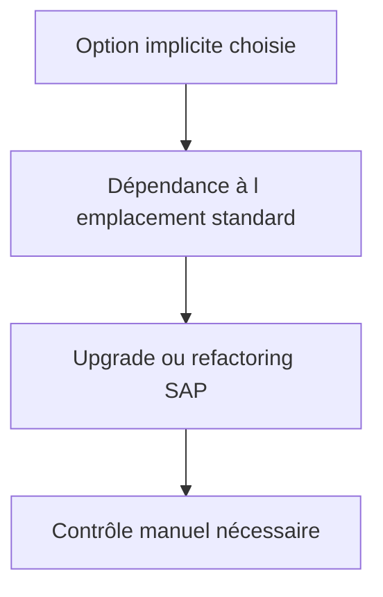

# 🌸 OPTIONS D’ENHANCEMENT IMPLICITES

## 🌺 OBJECTIFS

- Afficher les options implicites dans l’éditeur SAP GUI
- Choisir un emplacement stable
- Limiter le couplage au code standard

## 🌺 PRINCIPE

Le runtime fournit automatiquement des options implicites à certains emplacements, sans instruction `ENHANCEMENT-POINT` écrite dans le code. Elles peuvent être affichées dans l’éditeur ABAP via les opérations d’enhancement.

Emplacements courants :

- début et fin de `FORM`, module fonction ou méthode ;
- fin d’un programme ou include ;
- fin de certaines sections de classes ou interfaces ;
- listes de paramètres extensibles selon le type d’objet.

## 🌺 RISQUE

Une option implicite est moins explicite qu’un BAdI ou un point publié. Son emplacement peut devenir inadapté après une évolution du standard, même si l’objet d’implémentation reste actif.

## 🌺 RÈGLES

- utiliser l’option la plus locale possible ;
- ne pas copier un bloc standard complet ;
- déléguer immédiatement à une classe client ;
- éviter la dépendance à des variables locales instables ;
- documenter la justification de l’absence d’autre extension ;
- prévoir un contrôle dans `SPAU_ENH` après upgrade ;
- limiter les traitements coûteux en début ou fin de méthode appelée fréquemment.

## 🌺 RÉFÉRENCES OFFICIELLES SAP

- [Implicit Enhancement Options — SAP Help Portal](https://help.sap.com/docs/ABAP_PLATFORM_NEW/46a2cfc13d25463b8b9a3d2a3c3ba0d9/29e59441026aae5fe10000000a1550b0.html)
- [Enhancement Options — SAP Help Portal](https://help.sap.com/docs/ABAP_PLATFORM_NEW/46a2cfc13d25463b8b9a3d2a3c3ba0d9/fbe3d8403e37762ae10000000a155106.html)
- [ABAP Source Code Enhancements — SAP Help Portal](https://help.sap.com/docs/SAP_NETWEAVER_AS_ABAP_752/46a2cfc13d25463b8b9a3d2a3c3ba0d9/a047e94086087e7fe10000000a1550b0.html)

---

➡️ [Chapitre suivant — ENHANCEMENTS DE CLASSES PRE POST ET OVERWRITE](<./20 - 🍧 ENHANCEMENTS DE CLASSES PRE POST ET OVERWRITE.md>)
