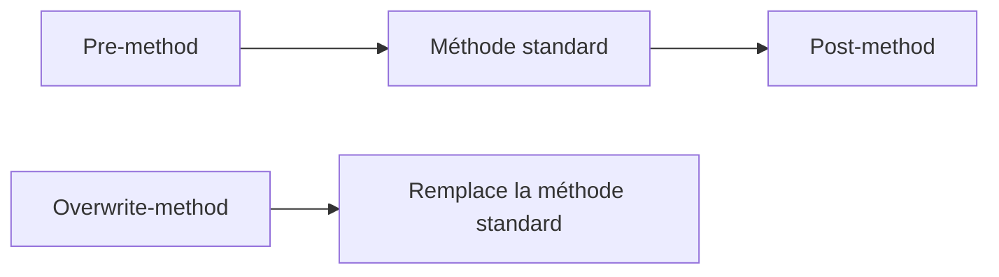

# 🌸 ENHANCEMENTS DE CLASSES : PRE, POST ET OVERWRITE

## 🌺 OBJECTIFS

- Étendre une classe globale sans la modifier directement
- Comprendre pre-method, post-method et overwrite-method
- Évaluer les risques de remplacement d’une méthode

## 🌺 MODES

| Mode             | Moment d’exécution                              | Effet                |
| ---------------- | ----------------------------------------------- | -------------------- |
| Pre-method       | Avant la méthode d’origine                      | Prétraitement        |
| Post-method      | Après la méthode d’origine si le flux le permet | Post-traitement      |
| Overwrite-method | À la place de la méthode d’origine              | Remplacement complet |

Une overwrite-method ne peut pas être combinée avec des pre/post methods pour la même méthode d’origine.

## 🌺 AUTRES EXTENSIONS DE CLASSE

Selon l’objet et la version, le framework permet notamment :

- ajout de méthodes ;
- ajout de composants ;
- ajout de paramètres facultatifs ;
- amélioration d’interfaces ou de groupes de fonctions.

## 🌺 RISQUES

L’overwrite-method copie implicitement la responsabilité du code standard. Les corrections futures de SAP dans la méthode d’origine ne sont plus exécutées. Ce mécanisme doit rester exceptionnel.

Pour un pre/post method :

- vérifier les exceptions ;
- ne pas supposer que le post-traitement s’exécutera après toute sortie selon la version et le flux ;
- éviter de modifier un état interne non prévu ;
- mesurer les effets sur toutes les sous-classes et tous les appelants.

## 🌺 RÉFÉRENCES OFFICIELLES SAP

- [Enhancements to Classes and Interfaces — SAP Help Portal](https://help.sap.com/docs/ABAP_PLATFORM_NEW/46a2cfc13d25463b8b9a3d2a3c3ba0d9/584fb541d3d52d31e10000000a155106.html)
- [Enhancing Components of Global Classes — SAP Help Portal](https://help.sap.com/docs/SAP_NETWEAVER_AS_ABAP_FOR_SOH_740/46a2cfc13d25463b8b9a3d2a3c3ba0d9/86b83142680d5c33e10000000a155106.html)
- [Enhancement Technologies — SAP Help Portal](https://help.sap.com/docs/ABAP_PLATFORM_NEW/46a2cfc13d25463b8b9a3d2a3c3ba0d9/7063da4023a28631e10000000a1550b0.html)

---

➡️ [Chapitre suivant — BADI DU ENHANCEMENT FRAMEWORK ET APPELS ABAP](<./21 - 🍧 BADI DU ENHANCEMENT FRAMEWORK ET APPELS ABAP.md>)
