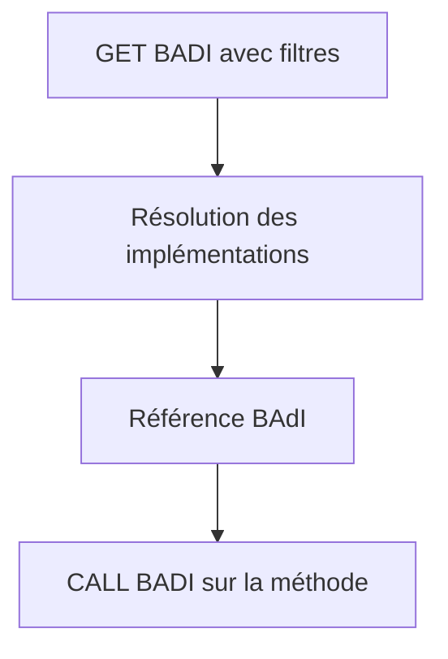

# 🌸 BAdI DU ENHANCEMENT FRAMEWORK ET APPELS ABAP

## 🌺 OBJECTIFS

- Comprendre `GET BADI` et `CALL BADI`
- Distinguer code fournisseur et code d’implémentation client
- Interpréter filtres et absence d’implémentation

## 🌺 CÔTÉ FOURNISSEUR

Une application qui définit et appelle son propre BAdI du Enhancement Framework peut utiliser :

```abap
DATA lo_badi TYPE REF TO zbadi_demo.

GET BADI lo_badi
  FILTERS
    country = lv_country.

CALL BADI lo_badi->change_data
  CHANGING
    cs_data = ls_data.
```

Ce code appartient au fournisseur du point d’extension. Lorsqu’un BAdI standard existe, le client crée une implémentation ; il ne modifie pas l’appel standard.

## 🌺 SÉLECTION



Le comportement en l’absence d’implémentation dépend des propriétés de la définition, notamment single-use, multiple-use et fallback. Le fournisseur doit concevoir ce cas explicitement.

## 🌺 PERFORMANCE

- résoudre la référence au niveau approprié ;
- ne pas exécuter une recherche coûteuse dans une boucle si le contexte est stable ;
- limiter le volume transmis ;
- documenter l’ordre attendu pour les BAdI multiple-use ;
- éviter les dépendances entre implémentations.

## 🌺 RÉFÉRENCES OFFICIELLES SAP

- [Business Add-Ins — SAP Help Portal](https://help.sap.com/docs/PRODUCT_ID/46a2cfc13d25463b8b9a3d2a3c3ba0d9/8ff2e540f8648431e10000000a1550b0.html)
- [Single-Use BAdI — SAP Help Portal](https://help.sap.com/docs/ABAP_PLATFORM_NEW/46a2cfc13d25463b8b9a3d2a3c3ba0d9/44f55e8acb460485e10000000a155369.html)
- [How to Use Filters — SAP Help Portal](https://help.sap.com/docs/ABAP_PLATFORM_NEW/46a2cfc13d25463b8b9a3d2a3c3ba0d9/44f6cd83912541aae10000000a114a6b.html)

---

➡️ [Chapitre suivant — BUSINESS TRANSACTION EVENTS AVEC FIBF](<./22 - 🍧 BUSINESS TRANSACTION EVENTS AVEC FIBF.md>)
