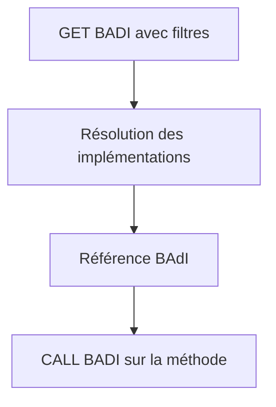

# 🌸 BAdI DU ENHANCEMENT FRAMEWORK ET APPELS ABAP

## 🌺 OBJECTIFS

- Comprendre `GET BADI` et `CALL BADI`
- Distinguer code fournisseur et code d’implémentation client
- Interpréter filtres et absence d’implémentation

## 🌺 CÔTÉ FOURNISSEUR

Une application qui définit et appelle son propre BAdI du Enhancement Framework peut utiliser :

```abap
DATA lo_badi TYPE REF TO zbadi_demo.

GET BADI lo_badi
  FILTERS
    country = lv_country.

CALL BADI lo_badi->change_data
  CHANGING
    cs_data = ls_data.
```

Ce code appartient au fournisseur du point d’extension. Lorsqu’un BAdI standard existe, le client crée une implémentation ; il ne modifie pas l’appel standard.

## 🌺 SÉLECTION



Le comportement en l’absence d’implémentation dépend des propriétés de la définition, notamment single-use, multiple-use et fallback. Le fournisseur doit concevoir ce cas explicitement.

## 🌺 PERFORMANCE

- résoudre la référence au niveau approprié ;
- ne pas exécuter une recherche coûteuse dans une boucle si le contexte est stable ;
- limiter le volume transmis ;
- documenter l’ordre attendu pour les BAdI multiple-use ;
- éviter les dépendances entre implémentations.

## 🌺 CAS D’USAGE

Dans un contexte où un besoin client doit compléter le comportement standard SAP sans modifier directement le code livré par SAP, le besoin consiste à **utiliser badi du enhancement framework et appels abap pour étendre le standard sans créer de modification directe ni d’effet de bord hors périmètre**. Cette notion est pertinente lorsque le lecteur doit pouvoir relier la syntaxe ou l’outil à une situation professionnelle concrète.

## 🌺 PROCÉDURE PAS À PAS

1. Saisir `/nSE18`.
2. Entrer le nom de la BAdI ou utiliser les outils de recherche.
3. Afficher la définition et lire documentation, interface, filtres et options d’utilisation multiple.
4. Analyser les implémentations existantes et leur ordre éventuel.
5. Identifier le point d’appel dans le code standard avant de créer une nouvelle implémentation.

## 🌺 VÉRIFICATION

- L’implémentation ou le projet est actif et transporté dans le bon ordre.
- Un breakpoint confirme que le point d’extension est appelé dans le scénario visé.
- Le comportement standard reste inchangé hors du périmètre fonctionnel prévu.
- Aucune modification directe d’un objet SAP standard n’a été créée.

## 🌺 ERREURS FRÉQUENTES

- Copier un exemple sans adapter les types, noms d’objets et données disponibles dans le système.
- Tester uniquement le cas nominal et ignorer les valeurs initiales, absentes ou invalides.
- Choisir le premier exit trouvé sans vérifier le moment exact de l’appel.
- Créer plusieurs implémentations concurrentes sans règles de filtre.

## 🌺 SNIPPET À RÉUTILISER

> [!NOTE]
> Adapter les noms `Z*`, les types DDIC, les données et les autorisations au système cible. Effectuer un contrôle syntaxique avant activation.

```abap
DATA lo_badi TYPE REF TO zbadi_demo.

GET BADI lo_badi
  FILTERS
    country = lv_country.

CALL BADI lo_badi->change_data
  CHANGING
    cs_data = ls_data.
```

## 🌺 TERMES DU LEXIQUE

- [ABAP](<../└─ 🧩 00 - LEXIQUE SAP ET ABAP/10 - 🍧 ACRONYMES SAP.md#acro-abap>)
- [BAdI](<../└─ 🧩 00 - LEXIQUE SAP ET ABAP/10 - 🍧 ACRONYMES SAP.md#acro-badi>)
- [BTE](<../└─ 🧩 00 - LEXIQUE SAP ET ABAP/10 - 🍧 ACRONYMES SAP.md#acro-bte>)
- [Objet Repository](<../└─ 🧩 00 - LEXIQUE SAP ET ABAP/03 - 🍧 REPOSITORY PACKAGES ET TRANSPORTS.md#objet-repository>)

## 🌺 À RETENIR

- À l’issue du chapitre, le lecteur sait **utiliser badi du enhancement framework et appels abap pour étendre le standard sans créer de modification directe ni d’effet de bord hors périmètre**.
- Toujours tester sur un objet Z ou un jeu de données sans impact avant d’intervenir sur un traitement réel.
- La documentation `F1` du système reste la référence pour la syntaxe disponible dans sa release.

## 🌺 RÉFÉRENCES OFFICIELLES SAP

- [Business Add-Ins — SAP Help Portal](https://help.sap.com/docs/PRODUCT_ID/46a2cfc13d25463b8b9a3d2a3c3ba0d9/8ff2e540f8648431e10000000a1550b0.html)
- [Single-Use BAdI — SAP Help Portal](https://help.sap.com/docs/ABAP_PLATFORM_NEW/46a2cfc13d25463b8b9a3d2a3c3ba0d9/44f55e8acb460485e10000000a155369.html)
- [How to Use Filters — SAP Help Portal](https://help.sap.com/docs/ABAP_PLATFORM_NEW/46a2cfc13d25463b8b9a3d2a3c3ba0d9/44f6cd83912541aae10000000a114a6b.html)


---

➡️ [Chapitre suivant — BUSINESS TRANSACTION EVENTS AVEC `FIBF`](<./22 - 🍧 BUSINESS TRANSACTION EVENTS AVEC FIBF.md>)
