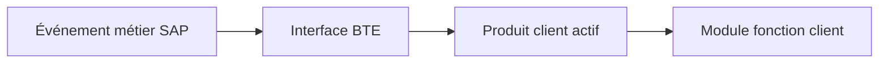

# 🌸 BUSINESS TRANSACTION EVENTS AVEC `FIBF`

## 🌺 OBJECTIFS

- Comprendre le principe des Business Transaction Events
- Identifier processus, interface et produit
- Implémenter un module fonction sans modifier l’application

## 🌺 PRINCIPE

Un BTE est un événement métier auquel une application permet de rattacher un module fonction client. Cette technologie est notamment rencontrée dans les domaines financiers.

SAP fournit généralement un module exemple décrivant l’interface. Le module client doit reprendre exactement cette interface.

## 🌺 DÉMARCHE

1. Ouvrir `FIBF`.
2. Rechercher le processus ou l’événement approprié.
3. Analyser le module exemple fourni par SAP.
4. Copier l’interface vers un module fonction client.
5. Implémenter la logique en déléguant à une classe.
6. Créer et activer le produit client.
7. Affecter le module au processus selon le Customizing prévu.
8. Tester le scénario complet et le contexte transactionnel.

## 🌺 PRÉCAUTIONS

- distinguer événements de publication et processus avec valeur de retour ;
- respecter l’interface du module exemple ;
- ne pas exécuter de commit ;
- vérifier si plusieurs produits peuvent être actifs ;
- contrôler le mandant et le transport du Customizing ;
- documenter l’ordre d’exécution observé.

## 🌺 RÉFÉRENCES OFFICIELLES SAP

- [BTE - Business Transaction Event — SAP Help Portal](https://help.sap.com/docs/SUPPORT_CONTENT/abap/3353525100.html)
- [Events, Business Transaction Events — SAP Help Portal](https://help.sap.com/docs/SAP_S4HANA_ON-PREMISE/e200555127f24878bed8d1481c9d5a0b/9601c5536a51204be10000000a174cb4.html)
- [Defining a Business Transaction Event — SAP Help Portal](https://help.sap.com/docs/SAP_S4HANA_ON-PREMISE/c30311a28bc24fe08bd47eafbf3fd930/59cc7fd2927f477bb965c77b3b71060f.html)

---

➡️ [Chapitre suivant — TRANSPORT DEBUG UPGRADE ET BONNES PRATIQUES](<./23 - 🍧 TRANSPORT DEBUG UPGRADE ET BONNES PRATIQUES.md>)
