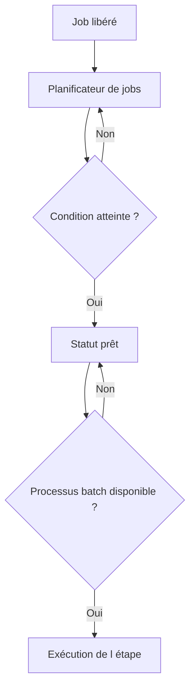

# 🌸 ARCHITECTURE ET PROCESSUS DE TRAVAIL BATCH

## 🌺 OBJECTIFS

- Comprendre où un job est exécuté
- Identifier le rôle du planificateur et des processus de travail
- Expliquer pourquoi un job peut attendre après son heure théorique

## 🌺 ARCHITECTURE SIMPLIFIÉE

Les processus de travail de fond sont configurés sur les serveurs d’application. Un job prêt peut rester en attente si aucune ressource compatible n’est disponible ou si des jobs de priorité supérieure doivent être servis.

## 🌺 SERVEUR CIBLE

Un job peut être affecté à un serveur d’application précis. Cette contrainte doit rester exceptionnelle : elle réduit les possibilités de répartition de charge et peut empêcher le démarrage si le serveur est indisponible.

Un serveur cible est justifié seulement lorsqu’une dépendance technique l’impose, par exemple :

- accès à une ressource locale au serveur ;
- commande externe installée sur un hôte précis ;
- configuration Basis spécifique ;
- contrainte explicitement documentée par SAP.

## 🌺 OUTILS D’ANALYSE

- `SM37` : statut et serveur d’exécution du job ;
- `SM50` : processus de travail de l’instance courante ;
- `SM51` : liste des serveurs d’application ;
- `RZ04` : modes d’exploitation et répartition des processus ;
- `SM21` : journal système.

## 🌺 RÉFÉRENCES OFFICIELLES SAP

- [Background Work Processes — SAP Help Portal](https://help.sap.com/docs/ABAP_PLATFORM_NEW/b07e7195f03f438b8e7ed273099d74f3/4b2b3c3e8eb51780e10000000a42189c.html)
- [Job Start Management — SAP Help Portal](https://help.sap.com/docs/ABAP_PLATFORM_NEW/b07e7195f03f438b8e7ed273099d74f3/4b2bc0094c594ba2e10000000a42189c.html)

---

➡️ [Chapitre suivant — JOBS ET ETAPES DE JOB](<./03 - 🍧 JOBS ET ETAPES DE JOB.md>)
