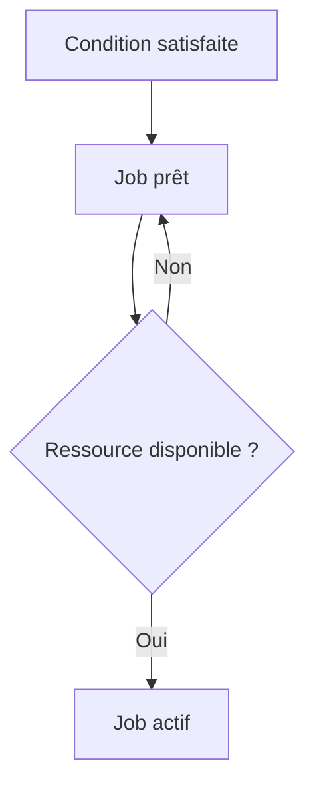

# 🌸 CONDITIONS DE DÉMARRAGE

## 🌺 OBJECTIFS

- Choisir un déclencheur adapté
- Comprendre la différence entre heure prévue et heure réelle
- Éviter les chaînes fragiles basées uniquement sur l’heure

## 🌺 TYPES DE CONDITIONS

| Condition           | Usage                                          |
| ------------------- | ---------------------------------------------- |
| Immédiat            | Exécution dès que possible après libération    |
| Date et heure       | Traitement planifié à un instant donné         |
| Après job           | Dépendance avec un job prédécesseur            |
| Après événement     | Démarrage lié à un signal technique ou métier  |
| Mode d’exploitation | Démarrage lors de l’activation d’un mode donné |

## 🌺 HEURE THÉORIQUE ET HEURE RÉELLE

La condition rend le job **éligible**. Elle ne garantit pas un démarrage exactement à la seconde prévue. Le job peut attendre :

- un processus de fond disponible ;
- la fin d’un job prioritaire ;
- la disponibilité du serveur cible ;
- la résolution d’un problème système.

## 🌺 DATE LIMITE

Une date ou fenêtre limite peut empêcher le démarrage tardif d’un traitement devenu inutile ou dangereux. Elle doit être définie selon les exigences métier, pas seulement pour masquer un problème de capacité.

## 🌺 RÉFÉRENCES OFFICIELLES SAP

- [Specifying Job Start Conditions — SAP Help Portal](https://help.sap.com/docs/ABAP_PLATFORM_NEW/b07e7195f03f438b8e7ed273099d74f3/4b2b2b4a365474fee10000000a421937.html)
- [Job Start Management — SAP Help Portal](https://help.sap.com/docs/ABAP_PLATFORM_NEW/b07e7195f03f438b8e7ed273099d74f3/4b2bc0094c594ba2e10000000a42189c.html)

---

➡️ [Chapitre suivant — CLASSES DE JOB PRIORITES ET SERVEUR CIBLE](<./08 - 🍧 CLASSES DE JOB PRIORITES ET SERVEUR CIBLE.md>)
