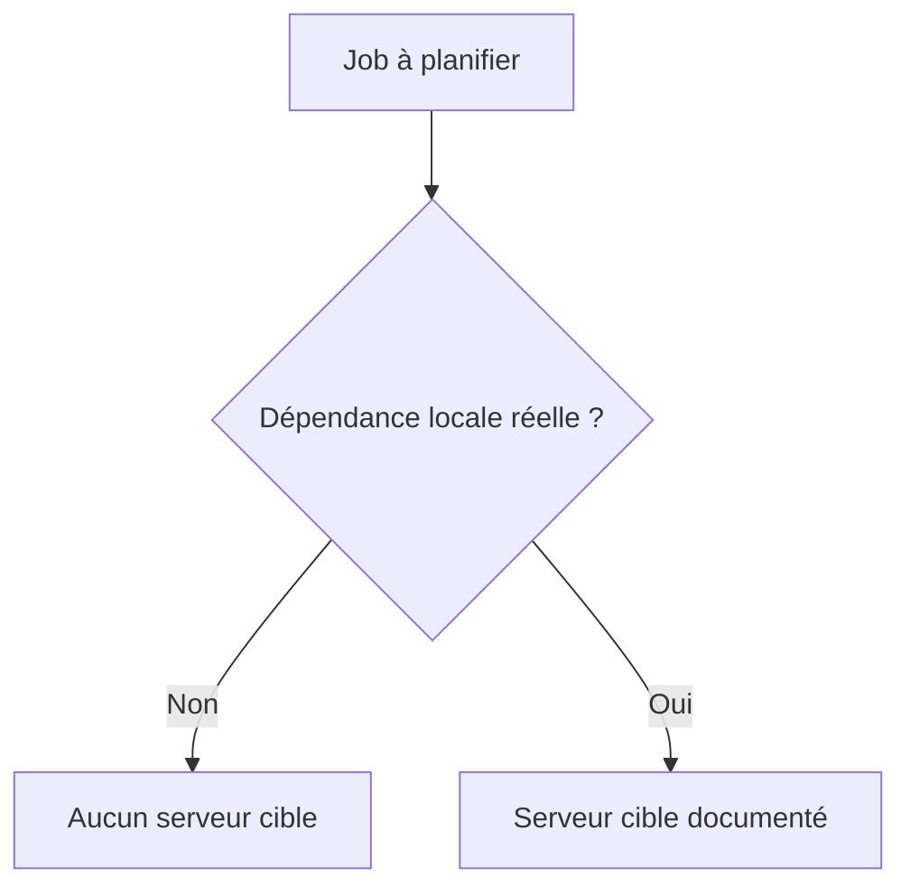

# 🌸 CLASSES DE JOB, PRIORITÉS ET SERVEUR CIBLE

## 🌺 OBJECTIFS

- Comprendre les classes `A`, `B` et `C`
- Éviter l’usage abusif des priorités élevées
- Savoir quand fixer un serveur cible

## 🌺 CLASSES

| Classe | Positionnement                                                |
| ------ | ------------------------------------------------------------- |
| `A`    | Priorité élevée, réservée aux traitements critiques autorisés |
| `B`    | Priorité intermédiaire                                        |
| `C`    | Priorité normale pour la majorité des jobs                    |

La classe influence l’ordre de prise en charge, mais elle ne corrige pas un programme lent ni une infrastructure insuffisante.

## 🌺 RÈGLE DE GOUVERNANCE

La classe `A` doit être attribuée selon une règle d’exploitation formalisée. Une multiplication de jobs `A` annule l’intérêt de la priorisation et peut pénaliser les traitements normaux.

## 🌺 SERVEUR CIBLE

Laisser le système répartir la charge est généralement préférable. Fixer un serveur seulement si une contrainte vérifiée l’exige.

## 🌺 DIAGNOSTIC

Si un job reste prêt :

- contrôler la classe ;
- vérifier les processus batch disponibles ;
- vérifier le serveur cible ;
- rechercher une saturation ou un arrêt d’instance ;
- analyser les modes d’exploitation.

## 🌺 RÉFÉRENCES OFFICIELLES SAP

- [Scheduling Background Jobs — SAP Help Portal](https://help.sap.com/docs/ABAP_PLATFORM_NEW/b07e7195f03f438b8e7ed273099d74f3/4b2b2954365474fee10000000a421937.html)
- [Background Work Processes — SAP Help Portal](https://help.sap.com/docs/ABAP_PLATFORM_NEW/b07e7195f03f438b8e7ed273099d74f3/4b2b3c3e8eb51780e10000000a42189c.html)

---

➡️ [Chapitre suivant — JOBS PERIODIQUES ET FENETRES D EXECUTION](<./09 - 🍧 JOBS PERIODIQUES ET FENETRES D EXECUTION.md>)
