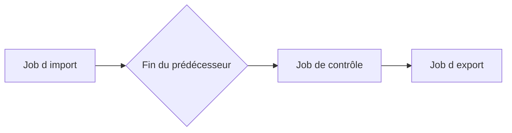

# 🌸 DÉPENDANCES ENTRE JOBS

## 🌺 OBJECTIFS

- Enchaîner des traitements sans dépendre d’horaires approximatifs
- Définir le comportement après succès ou échec
- Éviter les chaînes impossibles à reprendre

## 🌺 CONDITION « APRÈS JOB »

Un job peut attendre la fin d’un prédécesseur. Cette relation est préférable à un décalage horaire arbitraire lorsque le second traitement dépend réellement du premier.



## 🌺 SUCCÈS OU FIN QUELCONQUE

La configuration doit préciser si le successeur peut démarrer :

- uniquement après une fin normale ;
- même si le prédécesseur est annulé.

Le second choix est dangereux si le successeur suppose des données complètes.

## 🌺 CONCEPTION DE LA CHAÎNE

Documenter pour chaque étape :

- prérequis ;
- données produites ;
- critère de succès ;
- comportement en cas de doublon ;
- procédure de reprise ;
- personne ou équipe responsable.

## 🌺 LIMITE

Les dépendances classiques de `SM36` ne constituent pas un moteur complet de workflow. Une chaîne avec nombreuses branches, compensations et dépendances externes doit être gérée par un ordonnanceur ou une orchestration adaptée.

## 🌺 CAS D’USAGE

Dans un contexte où un traitement récurrent et volumineux doit s’exécuter sans session utilisateur, laisser des traces et pouvoir être repris, le besoin consiste à **configurer ou diagnostiquer dépendances entre jobs dans un traitement de fond traçable et relançable**. Cette notion est pertinente lorsque le lecteur doit pouvoir relier la syntaxe ou l’outil à une situation professionnelle concrète.

## 🌺 PROCÉDURE PAS À PAS

1. Saisir `/nSM36`.
2. Donner un nom explicite au job et définir sa classe/priorité selon les règles d’exploitation.
3. Ajouter une étape ABAP avec programme, variante et utilisateur d’exécution.
4. Définir la condition de démarrage : immédiate, date/heure, après job ou événement.
5. Enregistrer puis vérifier que le job est planifié.
6. Surveiller ensuite son exécution dans `SM37`.

## 🌺 VÉRIFICATION

- Le job apparaît dans `SM37` avec le statut attendu.
- Le journal ne contient pas de message d’erreur non traité.
- Le spool, le fichier ou le journal applicatif contient le résultat attendu.
- Une relance contrôlée ne crée pas de doublon métier.

## 🌺 ERREURS FRÉQUENTES

- Planifier un job avec l’utilisateur personnel d’un développeur.
- Relancer un job non idempotent après un échec partiel.

## 🌺 FICHE DE CONTRÔLE À COPIER

```text
Système / SID       :
Mandant             :
Utilisateur         :
Transaction / outil :
Objet technique     :
Jeu de données      :
Résultat attendu    :
Résultat observé    :
Horodatage          :
Ordre de transport  :
```

## 🌺 TERMES DU LEXIQUE

- [Job](<../└─ 🧩 00 - LEXIQUE SAP ET ABAP/06 - 🍧 PROGRAMMES CLASSES ET OBJETS TECHNIQUES.md#job>)
- [Spool](<../└─ 🧩 00 - LEXIQUE SAP ET ABAP/06 - 🍧 PROGRAMMES CLASSES ET OBJETS TECHNIQUES.md#spool>)
- [Processus background](<../└─ 🧩 00 - LEXIQUE SAP ET ABAP/08 - 🍧 EXECUTION EXPLOITATION ET ADMINISTRATION.md#processus-background>)
- [Variante](<../└─ 🧩 00 - LEXIQUE SAP ET ABAP/06 - 🍧 PROGRAMMES CLASSES ET OBJETS TECHNIQUES.md#variante>)

## 🌺 À RETENIR

- À l’issue du chapitre, le lecteur sait **configurer ou diagnostiquer dépendances entre jobs dans un traitement de fond traçable et relançable**.
- Toujours tester sur un objet Z ou un jeu de données sans impact avant d’intervenir sur un traitement réel.
- La documentation `F1` du système reste la référence pour la syntaxe disponible dans sa release.

## 🌺 RÉFÉRENCES OFFICIELLES SAP

- [Specifying Job Start Conditions — SAP Help Portal](https://help.sap.com/docs/ABAP_PLATFORM_NEW/b07e7195f03f438b8e7ed273099d74f3/4b2b2b4a365474fee10000000a421937.html)
- [Managing Jobs from the Job Overview — SAP Help Portal](https://help.sap.com/docs/ABAP_PLATFORM_NEW/b07e7195f03f438b8e7ed273099d74f3/4b2bc2224c594ba2e10000000a42189c.html)


---

➡️ [Chapitre suivant — ÉVÉNEMENTS DE FOND, `SM62` ET `SM64`](<./11 - 🍧 EVENEMENTS DE FOND SM62 ET SM64.md>)
