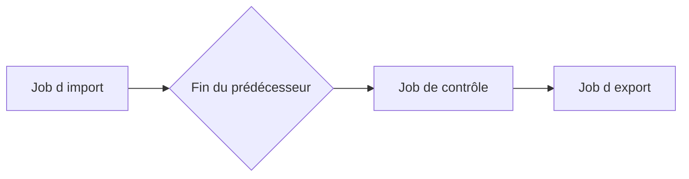

# 🌸 DÉPENDANCES ENTRE JOBS

## 🌺 OBJECTIFS

- Enchaîner des traitements sans dépendre d’horaires approximatifs
- Définir le comportement après succès ou échec
- Éviter les chaînes impossibles à reprendre

## 🌺 CONDITION « APRÈS JOB »

Un job peut attendre la fin d’un prédécesseur. Cette relation est préférable à un décalage horaire arbitraire lorsque le second traitement dépend réellement du premier.

## 🌺 SUCCÈS OU FIN QUELCONQUE

La configuration doit préciser si le successeur peut démarrer :

- uniquement après une fin normale ;
- même si le prédécesseur est annulé.

Le second choix est dangereux si le successeur suppose des données complètes.

## 🌺 CONCEPTION DE LA CHAÎNE

Documenter pour chaque étape :

- prérequis ;
- données produites ;
- critère de succès ;
- comportement en cas de doublon ;
- procédure de reprise ;
- personne ou équipe responsable.

## 🌺 LIMITE

Les dépendances classiques de `SM36` ne constituent pas un moteur complet de workflow. Une chaîne avec nombreuses branches, compensations et dépendances externes doit être gérée par un ordonnanceur ou une orchestration adaptée.

## 🌺 RÉFÉRENCES OFFICIELLES SAP

- [Specifying Job Start Conditions — SAP Help Portal](https://help.sap.com/docs/ABAP_PLATFORM_NEW/b07e7195f03f438b8e7ed273099d74f3/4b2b2b4a365474fee10000000a421937.html)
- [Managing Jobs from the Job Overview — SAP Help Portal](https://help.sap.com/docs/ABAP_PLATFORM_NEW/b07e7195f03f438b8e7ed273099d74f3/4b2bc2224c594ba2e10000000a42189c.html)

---

➡️ [Chapitre suivant — EVENEMENTS DE FOND SM62 ET SM64](<./11 - 🍧 EVENEMENTS DE FOND SM62 ET SM64.md>)
