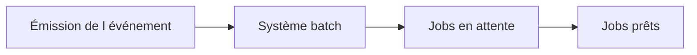

# 🌸 ÉVÉNEMENTS DE FOND, `SM62` ET `SM64`

## 🌺 OBJECTIFS

- Comprendre le déclenchement événementiel
- Distinguer définition et émission d’un événement
- Utiliser les arguments sans ambiguïté

## 🌺 PRINCIPE

Un événement informe le système de traitement de fond qu’une condition est satisfaite. Tous les jobs libérés qui attendent cet événement et son argument deviennent éligibles au démarrage.



## 🌺 TRANSACTIONS

- `SM62` : définition et historique des événements selon la version et l’écran utilisé ;
- `SM64` : déclenchement manuel et maintenance des événements de fond selon les autorisations disponibles.

Toujours vérifier le comportement exact dans le système cible, car les menus et libellés peuvent varier selon la version.

## 🌺 IDENTIFIANT ET ARGUMENT

L’identifiant représente le type d’événement. L’argument permet de distinguer une occurrence ou un contexte.

Exemple :

```text
Événement : Z_FILE_RECEIVED
Argument  : SALES_20260731.csv
```

## 🌺 BONNES PRATIQUES

- utiliser un préfixe client ;
- documenter l’émetteur ;
- définir si l’argument est obligatoire ;
- ne pas transmettre de données sensibles ;
- garantir que le consommateur peut être exécuté plusieurs fois sans corruption.

## 🌺 RÉFÉRENCES OFFICIELLES SAP

- [Events in Background Processing Explained — SAP Help Portal](https://help.sap.com/docs/ABAP_PLATFORM_NEW/b07e7195f03f438b8e7ed273099d74f3/4b2bbdd14c594ba2e10000000a42189c.html)
- [Defining Events — SAP Help Portal](https://help.sap.com/docs/ABAP_PLATFORM_NEW/b07e7195f03f438b8e7ed273099d74f3/4d9521f0d1b83c46e10000000a42189e.html)
- [Triggering Events from SAP GUI — SAP Help Portal](https://help.sap.com/docs/ABAP_PLATFORM_NEW/b07e7195f03f438b8e7ed273099d74f3/4d99bd4f786d1822e10000000a42189e.html)

---

➡️ [Chapitre suivant — DECLENCHER UN EVENEMENT EN ABAP](<./12 - 🍧 DECLENCHER UN EVENEMENT EN ABAP.md>)
