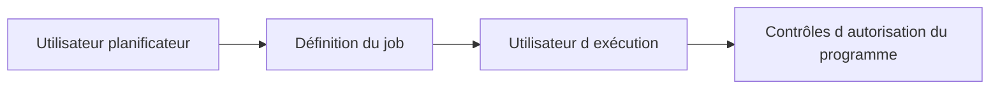

# 🌸 UTILISATEUR D’EXÉCUTION ET AUTORISATIONS

## 🌺 OBJECTIFS

- Comprendre sous quelle identité une étape s’exécute
- Identifier les principaux objets d’autorisation
- Éviter les comptes techniques surdimensionnés

## 🌺 UTILISATEUR D’EXÉCUTION

Chaque étape possède un utilisateur dont les autorisations sont utilisées pendant l’exécution. Le planificateur et l’utilisateur d’exécution peuvent être différents.

## 🌺 OBJETS PRINCIPAUX

| Objet        | Usage général                                                                      |
| ------------ | ---------------------------------------------------------------------------------- |
| `S_BTCH_JOB` | Actions sur les jobs, notamment libération ou gestion selon les valeurs autorisées |
| `S_BTCH_NAM` | Autoriser l’affectation d’un autre utilisateur d’exécution                         |
| `S_BTCH_ADM` | Administration étendue du traitement de fond                                       |
| `S_PROGRAM`  | Autorisation d’exécuter des groupes de programmes protégés                         |
| `S_RZL_ADM`  | Certaines opérations d’administration, notamment liées aux programmes externes     |

Les champs et valeurs exacts doivent être analysés dans `SU21` et via la documentation de l’objet sur le système cible.

## 🌺 COMPTE TECHNIQUE

Un compte batch doit :

- être nominativement ou fonctionnellement identifié ;
- disposer du minimum d’autorisations ;
- ne pas être un super-utilisateur ;
- avoir une gestion de mot de passe et de verrouillage adaptée à son type ;
- être surveillé et documenté ;
- être remplacé proprement lors d’un changement d’organisation.

## 🌺 DIAGNOSTIC

Un job peut être planifié avec succès puis échouer à l’exécution pour défaut d’autorisation. Examiner le journal, `SU53` lorsque le contexte le permet, et les traces `STAUTHTRACE` ou `ST01` selon la procédure de sécurité.

## 🌺 RÉFÉRENCES OFFICIELLES SAP

- [Roles and Authorizations for Background Processing — SAP Help Portal](https://help.sap.com/docs/ABAP_PLATFORM_NEW/621bb4e3951b4a8ca633ca7ed1c0aba2/4ec48f2468ac35fde10000000a42189e.html)
- [Defining Users for Background Processing — SAP Help Portal](https://help.sap.com/docs/ABAP_PLATFORM_BW4HANA/864321b9b3dd487d94c70f6a007b0397/4ec4b1bd745068b9e10000000a42189e.html)

---

➡️ [Chapitre suivant — SURVEILLER LES JOBS AVEC SM37](<./15 - 🍧 SURVEILLER LES JOBS AVEC SM37.md>)
