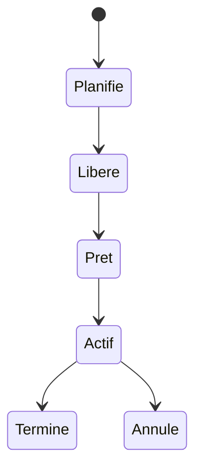

# 🌸 STATUTS D’UN JOB

## 🌺 OBJECTIFS

- Interpréter le cycle de vie d’un job
- Distinguer attente normale et anomalie
- Choisir l’action compatible avec le statut

## 🌺 CYCLE PRINCIPAL



Les libellés peuvent varier légèrement selon la langue et la version du système.

## 🌺 SIGNIFICATION

| Statut   | Interprétation                                                  |
| -------- | --------------------------------------------------------------- |
| Planifié | Définition enregistrée, pas encore libérée pour exécution       |
| Libéré   | Autorisé à démarrer lorsque la condition sera satisfaite        |
| Prêt     | Condition atteinte, attente d’un processus batch                |
| Actif    | Une étape est en cours d’exécution                              |
| Terminé  | Toutes les étapes se sont terminées normalement                 |
| Annulé   | Le job a été interrompu ou une étape a provoqué une terminaison |

## 🌺 « TERMINÉ » NE SIGNIFIE PAS TOUJOURS « MÉTIER RÉUSSI »

Un programme peut finir techniquement sans erreur tout en ayant rejeté toutes les données. Le statut du job doit être complété par :

- journal applicatif ;
- compteurs traités, réussis et rejetés ;
- fichier de rejet ;
- contrôle des données produites ;
- alerte métier.

## 🌺 JOB PRÊT TROP LONGTEMPS

Contrôler les processus batch, la classe, le serveur cible, les modes d’exploitation et la charge système.

## 🌺 CAS D’USAGE

Dans un contexte où un traitement récurrent et volumineux doit s’exécuter sans session utilisateur, laisser des traces et pouvoir être repris, le besoin consiste à **configurer ou diagnostiquer statuts d’un job dans un traitement de fond traçable et relançable**. Cette notion est pertinente lorsque le lecteur doit pouvoir relier la syntaxe ou l’outil à une situation professionnelle concrète.

## 🌺 PROCÉDURE PAS À PAS

1. Saisir `/nSM37`.
2. Renseigner le nom du job, l’utilisateur et une période suffisamment précise.
3. Exécuter la recherche et sélectionner le job correspondant au bon horodatage.
4. Lire le statut, le journal de job, les étapes et le spool.
5. En cas d’échec, relever le message, le programme, la variante, l’utilisateur et l’heure avant toute relance.

## 🌺 VÉRIFICATION

- Le job apparaît dans `SM37` avec le statut attendu.
- Le journal ne contient pas de message d’erreur non traité.
- Le spool, le fichier ou le journal applicatif contient le résultat attendu.
- Une relance contrôlée ne crée pas de doublon métier.

## 🌺 ERREURS FRÉQUENTES

- Planifier un job avec l’utilisateur personnel d’un développeur.
- Relancer un job non idempotent après un échec partiel.

## 🌺 FICHE DE CONTRÔLE À COPIER

```text
Système / SID       :
Mandant             :
Utilisateur         :
Transaction / outil :
Objet technique     :
Jeu de données      :
Résultat attendu    :
Résultat observé    :
Horodatage          :
Ordre de transport  :
```

## 🌺 TERMES DU LEXIQUE

- [Job](<../└─ 🧩 00 - LEXIQUE SAP ET ABAP/06 - 🍧 PROGRAMMES CLASSES ET OBJETS TECHNIQUES.md#job>)
- [Spool](<../└─ 🧩 00 - LEXIQUE SAP ET ABAP/06 - 🍧 PROGRAMMES CLASSES ET OBJETS TECHNIQUES.md#spool>)
- [Processus background](<../└─ 🧩 00 - LEXIQUE SAP ET ABAP/08 - 🍧 EXECUTION EXPLOITATION ET ADMINISTRATION.md#processus-background>)
- [Variante](<../└─ 🧩 00 - LEXIQUE SAP ET ABAP/06 - 🍧 PROGRAMMES CLASSES ET OBJETS TECHNIQUES.md#variante>)

## 🌺 À RETENIR

- À l’issue du chapitre, le lecteur sait **configurer ou diagnostiquer statuts d’un job dans un traitement de fond traçable et relançable**.
- Toujours tester sur un objet Z ou un jeu de données sans impact avant d’intervenir sur un traitement réel.
- La documentation `F1` du système reste la référence pour la syntaxe disponible dans sa release.

## 🌺 RÉFÉRENCES OFFICIELLES SAP

- [Possible Status of Background Jobs — SAP Help Portal](https://help.sap.com/docs/ABAP_PLATFORM_NEW/b07e7195f03f438b8e7ed273099d74f3/4b308aa91dd90a93e10000000a421937.html)
- [Job Was Not Started — SAP Help Portal](https://help.sap.com/docs/ABAP_PLATFORM_NEW/b07e7195f03f438b8e7ed273099d74f3/4b272c13d1341780e10000000a42189c.html)


---

➡️ [Chapitre suivant — JOURNAL DE JOB ET MESSAGES](<./17 - 🍧 JOURNAL DE JOB ET MESSAGES.md>)
