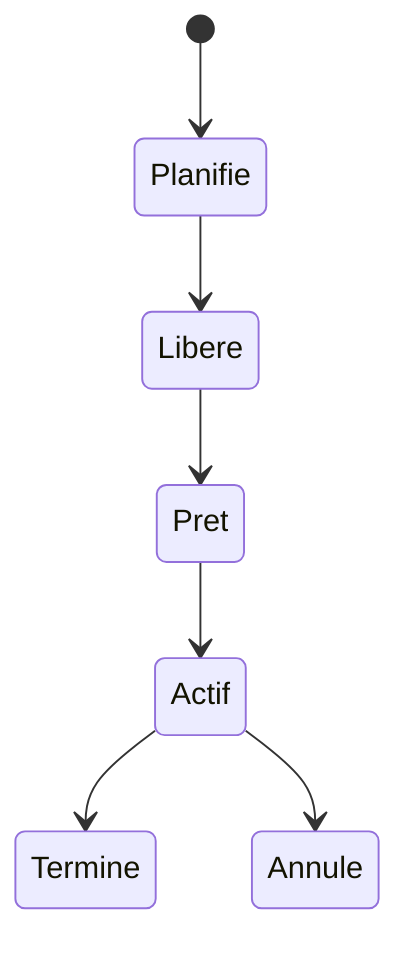

# 🌸 STATUTS D’UN JOB

## 🌺 OBJECTIFS

- Interpréter le cycle de vie d’un job
- Distinguer attente normale et anomalie
- Choisir l’action compatible avec le statut

## 🌺 CYCLE PRINCIPAL

Les libellés peuvent varier légèrement selon la langue et la version du système.

## 🌺 SIGNIFICATION

| Statut   | Interprétation                                                  |
| -------- | --------------------------------------------------------------- |
| Planifié | Définition enregistrée, pas encore libérée pour exécution       |
| Libéré   | Autorisé à démarrer lorsque la condition sera satisfaite        |
| Prêt     | Condition atteinte, attente d’un processus batch                |
| Actif    | Une étape est en cours d’exécution                              |
| Terminé  | Toutes les étapes se sont terminées normalement                 |
| Annulé   | Le job a été interrompu ou une étape a provoqué une terminaison |

## 🌺 « TERMINÉ » NE SIGNIFIE PAS TOUJOURS « MÉTIER RÉUSSI »

Un programme peut finir techniquement sans erreur tout en ayant rejeté toutes les données. Le statut du job doit être complété par :

- journal applicatif ;
- compteurs traités, réussis et rejetés ;
- fichier de rejet ;
- contrôle des données produites ;
- alerte métier.

## 🌺 JOB PRÊT TROP LONGTEMPS

Contrôler les processus batch, la classe, le serveur cible, les modes d’exploitation et la charge système.

## 🌺 RÉFÉRENCES OFFICIELLES SAP

- [Possible Status of Background Jobs — SAP Help Portal](https://help.sap.com/docs/ABAP_PLATFORM_NEW/b07e7195f03f438b8e7ed273099d74f3/4b308aa91dd90a93e10000000a421937.html)
- [Job Was Not Started — SAP Help Portal](https://help.sap.com/docs/ABAP_PLATFORM_NEW/b07e7195f03f438b8e7ed273099d74f3/4b272c13d1341780e10000000a42189c.html)

---

➡️ [Chapitre suivant — JOURNAL DE JOB ET MESSAGES](<./17 - 🍧 JOURNAL DE JOB ET MESSAGES.md>)
