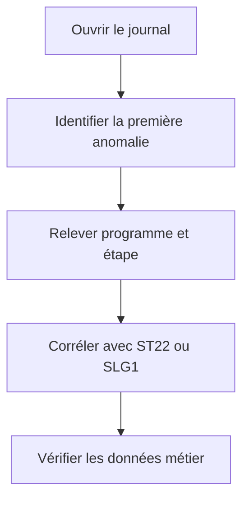

# 🌸 JOURNAL DE JOB ET MESSAGES

## 🌺 OBJECTIFS

- Lire le journal dans l’ordre chronologique
- Distinguer messages système et applicatifs
- Produire des informations exploitables

## 🌺 CONTENU

Le journal de job contient notamment :

- démarrage et fin des étapes ;
- programme et variante ;
- messages du système de traitement de fond ;
- erreurs émises par les programmes ABAP ;
- sorties ou erreurs de certains programmes externes ;
- informations de terminaison.

## 🌺 ANALYSE

La dernière erreur affichée peut n’être qu’une conséquence. Rechercher le premier message anormal et son contexte.

## 🌺 JOURNALISATION APPLICATIVE

Pour un traitement professionnel, enregistrer au minimum :

- identifiant de l’exécution ;
- plage de données ;
- nombre lu, traité, réussi et rejeté ;
- erreurs avec clé métier ;
- durée des phases ;
- statut final métier.

Le Business Application Log, consultable avec `SLG1`, est souvent plus adapté qu’une longue série de `WRITE` ou de messages génériques.

## 🌺 MESSAGES DANGEREUX

Des messages de type `A`, `E` ou certaines exceptions non traitées peuvent provoquer l’annulation du job. Le comportement doit être testé explicitement en arrière-plan.

## 🌺 RÉFÉRENCES OFFICIELLES SAP

- [Displaying a Job Log — SAP Help Portal](https://help.sap.com/docs/ABAP_PLATFORM_NEW/b07e7195f03f438b8e7ed273099d74f3/4b2bbd0f4c594ba2e10000000a42189c.html)
- [Background Processing Function Modules — SAP Help Portal](https://help.sap.com/docs/ABAP_PLATFORM_BW4HANA/7bfe8cdcfbb040dcb6702dada8c3e2f0/4d906689eba36e73e10000000a15822b.html)

---

➡️ [Chapitre suivant — SPOOL SORTIES ET DESTINATAIRES](<./18 - 🍧 SPOOL SORTIES ET DESTINATAIRES.md>)
