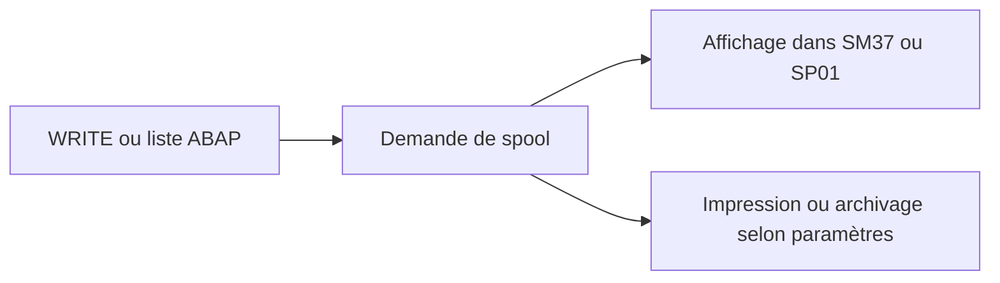

# 🌸 SPOOL, SORTIES ET DESTINATAIRES

## 🌺 OBJECTIFS

- Comprendre où va la sortie d’une liste ABAP
- Configurer les paramètres d’impression
- Éviter les spools massifs ou inutiles

## 🌺 PRINCIPE

Lorsqu’un programme ABAP exécuté en arrière-plan produit une liste, la sortie est enregistrée dans le système de spool.

## 🌺 PARAMÈTRES

Une étape peut définir notamment :

- périphérique de sortie ;
- impression immédiate ;
- suppression après impression ;
- nombre de copies ;
- titre ;
- destinataire de la liste ;
- options d’archivage selon la configuration.

## 🌺 RISQUES

- millions de lignes écrites dans un spool ;
- saturation des tables et fichiers de spool ;
- données sensibles accessibles à des utilisateurs non autorisés ;
- sortie illisible parce que la largeur de page n’est pas adaptée ;
- conservation trop longue.

## 🌺 RECOMMANDATION

Un rapport batch ne doit pas utiliser le spool comme base de données. Produire une synthèse et stocker les détails dans un journal applicatif ou un fichier contrôlé.

## 🌺 OUTILS

- `SM37` : spool lié au job ;
- `SP01` : demandes de spool ;
- `SPAD` : administration des périphériques, réservée aux équipes compétentes.

## 🌺 RÉFÉRENCES OFFICIELLES SAP

- [Obtaining Printing and Archiving Specifications — SAP Help Portal](https://help.sap.com/docs/ABAP_PLATFORM_NEW/b07e7195f03f438b8e7ed273099d74f3/4d9110b58e4f34b7e10000000a42189c.html)
- [Background Work Processes — SAP Help Portal](https://help.sap.com/docs/ABAP_PLATFORM_NEW/b07e7195f03f438b8e7ed273099d74f3/4b2b3c3e8eb51780e10000000a42189c.html)

---

➡️ [Chapitre suivant — MODIFIER COPIER REPLANIFIER ANNULER ET SUPPRIMER](<./19 - 🍧 MODIFIER COPIER REPLANIFIER ANNULER ET SUPPRIMER.md>)
