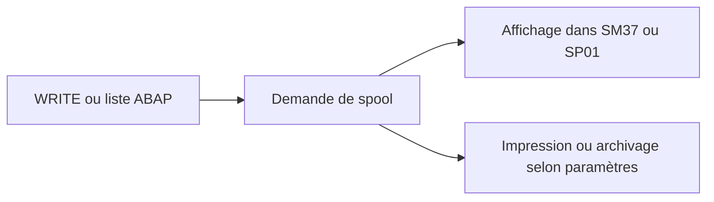

# 🌸 SPOOL, SORTIES ET DESTINATAIRES

## 🌺 OBJECTIFS

- Comprendre où va la sortie d’une liste ABAP
- Configurer les paramètres d’impression
- Éviter les spools massifs ou inutiles

## 🌺 PRINCIPE

Lorsqu’un programme ABAP exécuté en arrière-plan produit une liste, la sortie est enregistrée dans le système de spool.



## 🌺 PARAMÈTRES

Une étape peut définir notamment :

- périphérique de sortie ;
- impression immédiate ;
- suppression après impression ;
- nombre de copies ;
- titre ;
- destinataire de la liste ;
- options d’archivage selon la configuration.

## 🌺 RISQUES

- millions de lignes écrites dans un spool ;
- saturation des tables et fichiers de spool ;
- données sensibles accessibles à des utilisateurs non autorisés ;
- sortie illisible parce que la largeur de page n’est pas adaptée ;
- conservation trop longue.

## 🌺 RECOMMANDATION

Un rapport batch ne doit pas utiliser le spool comme base de données. Produire une synthèse et stocker les détails dans un journal applicatif ou un fichier contrôlé.

## 🌺 OUTILS

- `SM37` : spool lié au job ;
- `SP01` : demandes de spool ;
- `SPAD` : administration des périphériques, réservée aux équipes compétentes.

## 🌺 CAS D’USAGE

Dans un contexte où un traitement récurrent et volumineux doit s’exécuter sans session utilisateur, laisser des traces et pouvoir être repris, le besoin consiste à **configurer ou diagnostiquer spool, sorties et destinataires dans un traitement de fond traçable et relançable**. Cette notion est pertinente lorsque le lecteur doit pouvoir relier la syntaxe ou l’outil à une situation professionnelle concrète.

## 🌺 PROCÉDURE PAS À PAS

1. Saisir `/nSM37`.
2. Renseigner le nom du job, l’utilisateur et une période suffisamment précise.
3. Exécuter la recherche et sélectionner le job correspondant au bon horodatage.
4. Lire le statut, le journal de job, les étapes et le spool.
5. En cas d’échec, relever le message, le programme, la variante, l’utilisateur et l’heure avant toute relance.

## 🌺 VÉRIFICATION

- Le job apparaît dans `SM37` avec le statut attendu.
- Le journal ne contient pas de message d’erreur non traité.
- Le spool, le fichier ou le journal applicatif contient le résultat attendu.
- Une relance contrôlée ne crée pas de doublon métier.

## 🌺 ERREURS FRÉQUENTES

- Planifier un job avec l’utilisateur personnel d’un développeur.
- Relancer un job non idempotent après un échec partiel.

## 🌺 FICHE DE CONTRÔLE À COPIER

```text
Système / SID       :
Mandant             :
Utilisateur         :
Transaction / outil :
Objet technique     :
Jeu de données      :
Résultat attendu    :
Résultat observé    :
Horodatage          :
Ordre de transport  :
```

## 🌺 TERMES DU LEXIQUE

- [Spool](<../└─ 🧩 00 - LEXIQUE SAP ET ABAP/06 - 🍧 PROGRAMMES CLASSES ET OBJETS TECHNIQUES.md#spool>)
- [Job](<../└─ 🧩 00 - LEXIQUE SAP ET ABAP/06 - 🍧 PROGRAMMES CLASSES ET OBJETS TECHNIQUES.md#job>)
- [Processus background](<../└─ 🧩 00 - LEXIQUE SAP ET ABAP/08 - 🍧 EXECUTION EXPLOITATION ET ADMINISTRATION.md#processus-background>)
- [Variante](<../└─ 🧩 00 - LEXIQUE SAP ET ABAP/06 - 🍧 PROGRAMMES CLASSES ET OBJETS TECHNIQUES.md#variante>)

## 🌺 À RETENIR

- À l’issue du chapitre, le lecteur sait **configurer ou diagnostiquer spool, sorties et destinataires dans un traitement de fond traçable et relançable**.
- Toujours tester sur un objet Z ou un jeu de données sans impact avant d’intervenir sur un traitement réel.
- La documentation `F1` du système reste la référence pour la syntaxe disponible dans sa release.

## 🌺 RÉFÉRENCES OFFICIELLES SAP

- [Obtaining Printing and Archiving Specifications — SAP Help Portal](https://help.sap.com/docs/ABAP_PLATFORM_NEW/b07e7195f03f438b8e7ed273099d74f3/4d9110b58e4f34b7e10000000a42189c.html)
- [Background Work Processes — SAP Help Portal](https://help.sap.com/docs/ABAP_PLATFORM_NEW/b07e7195f03f438b8e7ed273099d74f3/4b2b3c3e8eb51780e10000000a42189c.html)


---

➡️ [Chapitre suivant — MODIFIER, COPIER, REPLANIFIER, ANNULER ET SUPPRIMER](<./19 - 🍧 MODIFIER COPIER REPLANIFIER ANNULER ET SUPPRIMER.md>)
