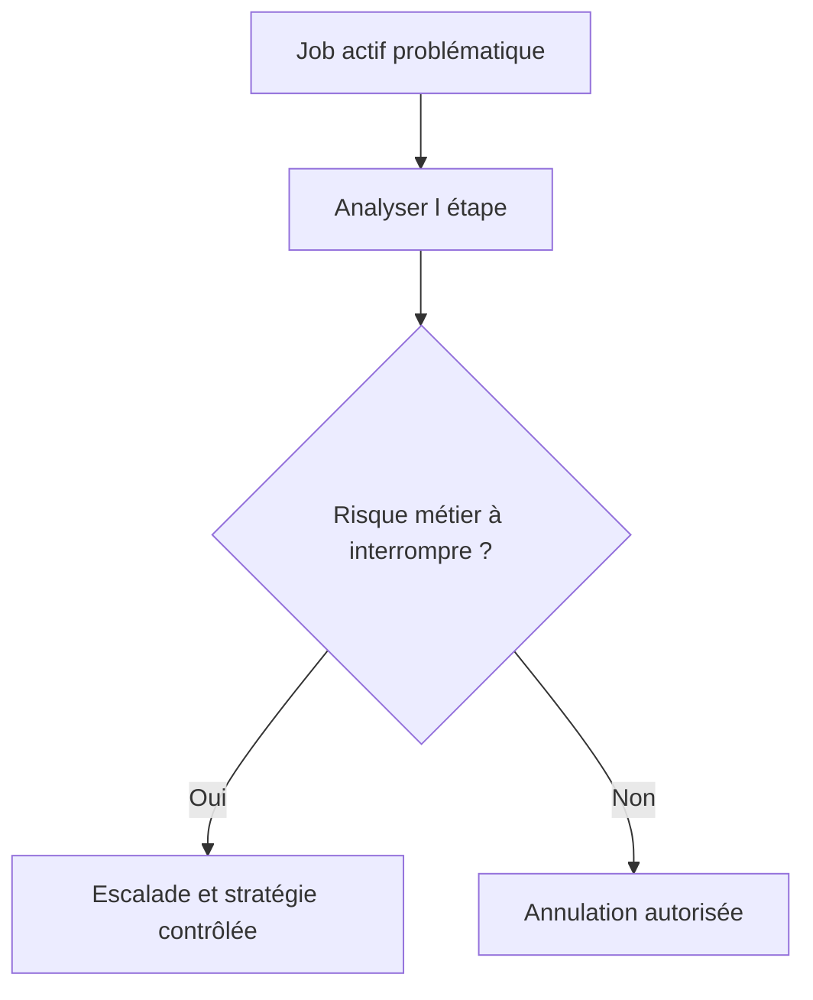

# 🌸 MODIFIER, COPIER, REPLANIFIER, ANNULER ET SUPPRIMER

## 🌺 OBJECTIFS

- Choisir l’action appropriée selon le statut
- Préserver les preuves avant une intervention
- Éviter les modifications non maîtrisées d’une série périodique

## 🌺 ACTIONS PRINCIPALES

| Action                | Usage                                                    |
| --------------------- | -------------------------------------------------------- |
| Copier                | Créer une nouvelle définition à partir d’un job existant |
| Replanifier           | Affecter une nouvelle condition de démarrage             |
| Retirer la libération | Empêcher un job encore modifiable de démarrer            |
| Annuler               | Interrompre un job actif                                 |
| Supprimer             | Retirer une définition ou un historique selon le statut  |

Les actions disponibles dépendent du statut et des autorisations.

## 🌺 AVANT D’ANNULER

1. identifier l’étape active ;
2. vérifier si le programme est en phase d’écriture ;
3. rechercher les verrous dans `SM12` ;
4. vérifier les effets externes déjà déclenchés ;
5. déterminer la procédure de reprise ;
6. conserver le journal et les éléments de diagnostic.

## 🌺 JOB PÉRIODIQUE

Modifier une occurrence ne modifie pas nécessairement toute la série de la manière attendue. Après intervention, vérifier la prochaine date planifiée et l’existence d’éventuelles occurrences en doublon.

## 🌺 RÉFÉRENCES OFFICIELLES SAP

- [Managing Jobs from the Job Overview — SAP Help Portal](https://help.sap.com/docs/ABAP_PLATFORM_NEW/b07e7195f03f438b8e7ed273099d74f3/4b2bc2224c594ba2e10000000a42189c.html)
- [Possible Status of Background Jobs — SAP Help Portal](https://help.sap.com/docs/ABAP_PLATFORM_NEW/b07e7195f03f438b8e7ed273099d74f3/4b308aa91dd90a93e10000000a421937.html)

---

➡️ [Chapitre suivant — DEBUGGER UN JOB AVEC JDBG](<./20 - 🍧 DEBUGGER UN JOB AVEC JDBG.md>)
