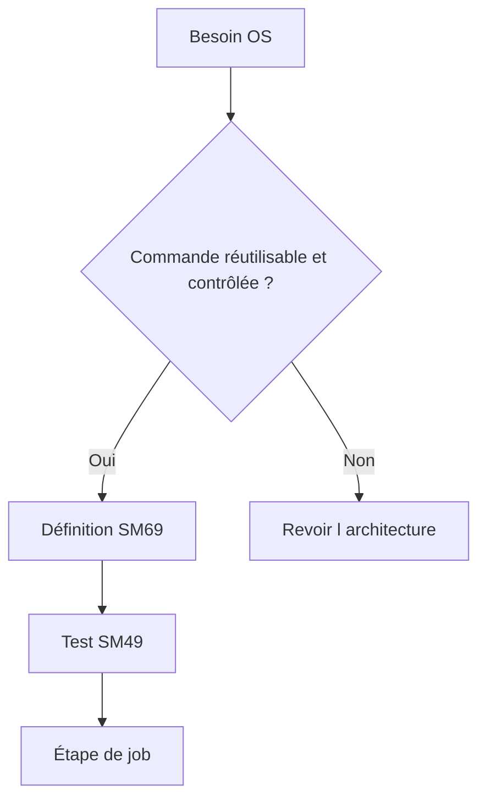

# 🌸 COMMANDES ET PROGRAMMES EXTERNES

## 🌺 OBJECTIFS

- Distinguer commande externe et programme externe
- Utiliser `SM69` et `SM49` de manière sécurisée
- Diagnostiquer les erreurs SAPXPG

## 🌺 DISTINCTION

Une **commande externe** est prédéfinie et administrée dans SAP, généralement avec `SM69`. Un **programme externe** peut être spécifié plus directement et nécessite des autorisations d’administration plus fortes.

## 🌺 SÉCURITÉ

Une commande externe peut donner accès au système d’exploitation. Elle doit imposer :

- chemin absolu ou environnement maîtrisé ;
- paramètres autorisés limités ;
- utilisateur OS adapté ;
- interdiction d’injection de commandes ;
- journalisation ;
- restrictions d’autorisation ;
- validation par l’administration Basis et sécurité.

## 🌺 OUTILS

- `SM69` : définition des commandes externes ;
- `SM49` : test d’une commande définie ;
- `SM37` : journal de l’étape ;
- trace SAPXPG : diagnostic des exécutions externes selon la configuration.

## 🌺 ERREURS COURANTES

- exécutable absent sur le serveur cible ;
- droits OS insuffisants ;
- paramètres mal échappés ;
- différence de répertoire ou d’environnement ;
- code retour non nul ;
- sortie d’erreur dans le journal ;
- serveur cible incompatible.

## 🌺 RÉFÉRENCES OFFICIELLES SAP

- [External Commands and External Programs — SAP Help Portal](https://help.sap.com/docs/ABAP_PLATFORM_NEW/b07e7195f03f438b8e7ed273099d74f3/4b2bbe5e4c594ba2e10000000a42189c.html)
- [Defining External Commands — SAP Help Portal](https://help.sap.com/docs/ABAP_PLATFORM_NEW/b07e7195f03f438b8e7ed273099d74f3/4b2b3e958eb51780e10000000a42189c.html)
- [Analyzing Problems with External Commands — SAP Help Portal](https://help.sap.com/docs/ABAP_PLATFORM_NEW/b07e7195f03f438b8e7ed273099d74f3/4b272d0ed1341780e10000000a42189c.html)

---

➡️ [Chapitre suivant — ANALYSER LES ECHECS ET LES RETARDS](<./22 - 🍧 ANALYSER LES ECHECS ET LES RETARDS.md>)
