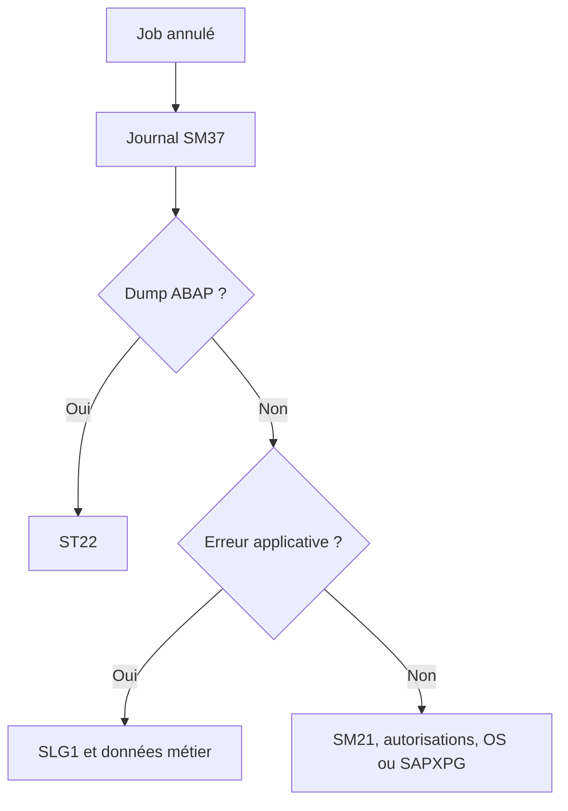

# 🌸 ANALYSER LES ÉCHECS ET LES RETARDS

## 🌺 OBJECTIFS

- Appliquer une méthode de diagnostic reproductible
- Distinguer un job non démarré, lent ou annulé
- Corréler les outils SAP

## 🌺 JOB NON DÉMARRÉ

Contrôler dans cet ordre :

1. statut libéré ;
2. condition de démarrage atteinte ;
3. date limite non dépassée ;
4. serveur cible disponible ;
5. processus batch disponibles ;
6. classe et concurrence ;
7. autorisations de libération ;
8. cohérence du système de jobs.

## 🌺 JOB ANNULÉ

## 🌺 JOB LENT

- mesurer la durée par phase ;
- analyser SQL avec `ST05` ;
- analyser le runtime avec `SAT` ou `ST12` ;
- contrôler les volumes de sélection ;
- vérifier les verrous et attentes ;
- rechercher les exécutions simultanées ;
- contrôler le serveur et les processus ;
- comparer avec une exécution précédente de volume similaire.

## 🌺 DONNÉES À CONSERVER

- nom et numéro du job ;
- date, heure et client ;
- utilisateur d’exécution ;
- programme et variante ;
- serveur ;
- statut ;
- journal ;
- spool ;
- dump éventuel ;
- volumes ;
- traces et identifiants applicatifs.

## 🌺 RÉFÉRENCES OFFICIELLES SAP

- [Job Was Not Started — SAP Help Portal](https://help.sap.com/docs/ABAP_PLATFORM_NEW/b07e7195f03f438b8e7ed273099d74f3/4b272c13d1341780e10000000a42189c.html)
- [Managing Jobs from the Job Overview — SAP Help Portal](https://help.sap.com/docs/ABAP_PLATFORM_NEW/b07e7195f03f438b8e7ed273099d74f3/4b2bc2224c594ba2e10000000a42189c.html)
- [Job Storage Management — SAP Help Portal](https://help.sap.com/docs/ABAP_PLATFORM_NEW/b07e7195f03f438b8e7ed273099d74f3/4b2bc0974c594ba2e10000000a42189c.html)

---

➡️ [Chapitre suivant — CONCEPTION REPRISE IDEMPOTENCE ET BONNES PRATIQUES](<./23 - 🍧 CONCEPTION REPRISE IDEMPOTENCE ET BONNES PRATIQUES.md>)
