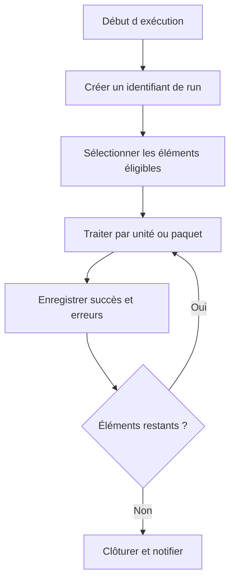

# 🌸 CONCEPTION, REPRISE, IDEMPOTENCE ET BONNES PRATIQUES

## 🌺 OBJECTIFS

- Concevoir un job exploitable en production
- Permettre une reprise sans doublon
- Fournir une checklist de livraison

## 🌺 PROPRIÉTÉS D’UN JOB ROBUSTE

Un job professionnel doit être :

- **idempotent** : une relance ne corrompt pas les données ;
- **reprenable** : les éléments restant à traiter sont identifiables ;
- **observable** : compteurs, erreurs et identifiant d’exécution sont disponibles ;
- **borné** : le volume et la durée sont maîtrisés ;
- **sécurisé** : utilisateur et autorisations minimales ;
- **documenté** : fréquence, dépendances, variante, responsable et procédure d’incident.

## 🌺 STRATÉGIE DE REPRISE

## 🌺 PRINCIPES

- ne pas considérer le statut `Terminé` comme preuve suffisante du succès métier ;
- empêcher les exécutions concurrentes incompatibles ;
- utiliser des clés métier ou identifiants techniques pour éviter les doublons ;
- prévoir les commits selon des unités cohérentes ;
- ne pas masquer une erreur par une simple poursuite ;
- distinguer erreurs temporaires et définitives ;
- conserver les données de rejet ;
- ne pas dépendre d’une ressource frontend ;
- tester l’annulation en cours de traitement ;
- tester la reprise après échec partiel.

## 🌺 CHECKLIST

- [ ] Programme compatible `sy-batch`
- [ ] Variante versionnée ou gouvernée
- [ ] Nom de job explicite
- [ ] Classe justifiée
- [ ] Aucun serveur cible sans nécessité
- [ ] Utilisateur technique minimal
- [ ] Pas d’interaction SAP GUI
- [ ] Journal métier avec compteurs
- [ ] Spool limité et sans données sensibles inutiles
- [ ] Concurrence contrôlée
- [ ] Idempotence démontrée
- [ ] Reprise documentée
- [ ] Alertes et responsabilité définies
- [ ] Test avec volume représentatif
- [ ] Diagnostic `SM37`, `ST22`, `SLG1`, `ST12` documenté
- [ ] Nettoyage des anciens jobs et spools pris en charge par l’exploitation

## 🌺 JOBS TECHNIQUES STANDARD

SAP fournit des jobs techniques de nettoyage et de collecte à planifier selon les recommandations du produit et de la version. Leur fréquence et leur activation relèvent de l’administration du système, pas d’une convention générique de développement.

## 🌺 RÉFÉRENCES OFFICIELLES SAP

- [Background Processing: Concepts and Features — SAP Help Portal](https://help.sap.com/docs/ABAP_PLATFORM_NEW/3ad3ba0715c5422eae08578d4c40328d/4b2b51c34c594ba2e10000000a42189c.html)
- [Standard Jobs — SAP Help Portal](https://help.sap.com/docs/ABAP_PLATFORM_NEW/b07e7195f03f438b8e7ed273099d74f3/4b26c6e6d7441ff8e10000000a42189c.html)
- [Managing Jobs from the Job Overview — SAP Help Portal](https://help.sap.com/docs/ABAP_PLATFORM_NEW/b07e7195f03f438b8e7ed273099d74f3/4b2bc2224c594ba2e10000000a42189c.html)
