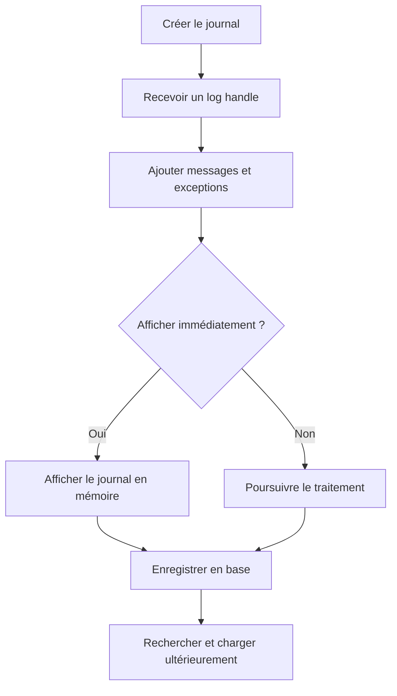

# 🌸 ARCHITECTURE ET CYCLE DE VIE DU BAL

## 🌺 OBJECTIFS

- Comprendre le cycle de vie d’un journal
- Distinguer le handle du numéro de journal en base
- Identifier les opérations réalisées en mémoire et en base

## 🌺 CYCLE DE VIE

Les fonctions `BAL_LOG_*` travaillent principalement sur les journaux présents dans la mémoire globale du groupe de fonctions BAL. La fonction `BAL_DB_SAVE` assure ensuite la persistance.

## 🌺 IDENTIFIANTS

| Identifiant     | Rôle                                                    |
| --------------- | ------------------------------------------------------- |
| Object          | Domaine applicatif stable                               |
| Subobject       | Sous-processus ou scénario                              |
| External number | Identifiant métier ou technique exploitable dans `SLG1` |
| Log handle      | Identifiant technique permanent du journal              |
| Log number      | Numéro interne attribué lors de la sauvegarde en base   |
| Message handle  | Identifie un message précis dans un journal             |

Le **log handle** est disponible dès la création. Le numéro interne de base n’est définitivement attribué qu’au moment de la sauvegarde.

## 🌺 DONNÉES PHYSIQUES

Les données persistées sont gérées par le framework BAL. Le code applicatif ne doit pas écrire directement dans les tables techniques du journal, notamment `BALHDR`, `BALDAT` ou `BAL_INDX`.

## 🌺 RÈGLE DE CONCEPTION

Encapsuler le BAL dans une classe ou un composant applicatif évite de disperser les appels de modules fonction dans tout le programme. L’appelant doit manipuler des opérations métier comme `ADD_SUCCESS`, `ADD_WARNING`, `ADD_EXCEPTION` et `SAVE`.

## 🌺 RÉFÉRENCES OFFICIELLES SAP

- [Basics — SAP Help Portal](https://help.sap.com/docs/ABAP_PLATFORM_NEW/addb96cd90c945dfb3182865363bbc47/4e21029235d44180e10000000a15822b.html)
- [Database Interface — SAP Help Portal](https://help.sap.com/docs/ABAP_PLATFORM_NEW/addb96cd90c945dfb3182865363bbc47/4e21021635d44180e10000000a15822b.html)
- [Function Module Overview — SAP Help Portal](https://help.sap.com/docs/ABAP_PLATFORM_NEW/addb96cd90c945dfb3182865363bbc47/4e23b1720771417fe10000000a15822b.html)

---

➡️ [Chapitre suivant — OBJETS SOUS OBJETS ET IDENTIFIANTS](<./03 - 🍧 OBJETS SOUS OBJETS ET IDENTIFIANTS.md>)
